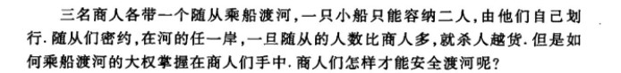

## 数学表达

过河问题一般是对于商人、农人等需要经过某一条河流，将身边物体运到另一条河流上。这里用**姜启源**的《**数学建模**》这本书中的例题进行说明。

如上图所示关于这个问题的描述，首先我们需要寻找一种方式表达某岸的人员的状况，同时需要一种表达船上人员的状态。将问题转化为在状态允许的范围内，确定每一步的决策，达到渡河的目的。

记第$k$次渡河前此案的商人数为$x_{k}$，随从数为$y_{k},k=1,2,\cdots,x_{k},y_{k}=0,1,2,3$。将二维向量$s_{k}=(x_{k},y_{k})$定义为状态，安全渡河条件下的状态集合称为允许状态集合，记为$S$.

$$S=\{(x,y)|x=0,y=0,1,2,3;x=3,y=0,1,2,3;x=y=1,2\}$$

记第$k$次渡船上的商人数为$u_{k}$，随从数为$v_{k}$。将二维向量$d_{k}=(u_{k},v_{k})$定义为决策。允许决策集合记作$D$，由小船的容量可知

$$D=\{(u,v)|1\le u+v \le 2,u,v=0,1,2\}$$

又因为$k$为奇数时船从此岸驶向彼岸，$k$为偶数时船由彼岸驶回此岸，所以状态$s_{k}$随决策$d_{k}$变化的规律是

$$s_{k+1}=s_{k}+(-1)^{k}d_{k}$$

这样渡河方案归纳为如下多步决策模型：

求决策$d_{k} \in D(k=1,2,\cdots,n)$，使状态$s_{k}\in S$按照转移律，由初始状态$s_{1}=(3,3)$经有限步$n$到达状态$s_{k+1}=(0,0)$

以上我们构建了多步决策模型，该如何编程求解呢？

## 程序实现

