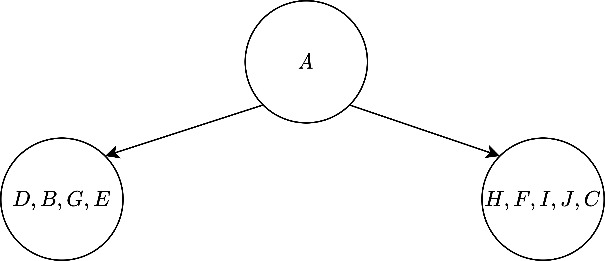

>一道题：
>
>已知先序周游序列为$A,B,D,E,G,C,F,H,I,J$，对称周游序列为$D,B,G,E,A,H,F,I,J,C$

求解该题，需要了解二叉树的周游的基本式，先序为$NLR$；对称为$LNR$。所以这里需要用整体思想

例如：

在先序周游序列中$A$为根，所以在对称周游序列中$D,B,G,E$为左子树，$H,F,I,J,C$为右子树。

所以可以看为如下树。

然后又将左边视为一个树，右边视为一个树，继续如上操作即可

