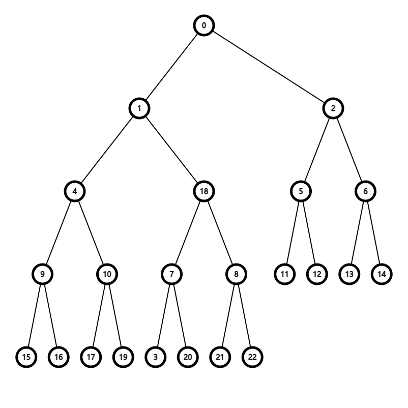
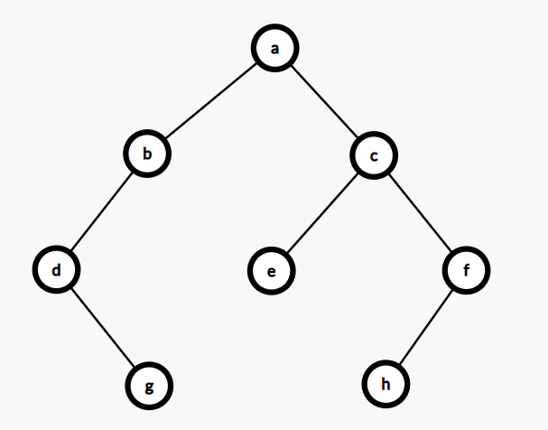
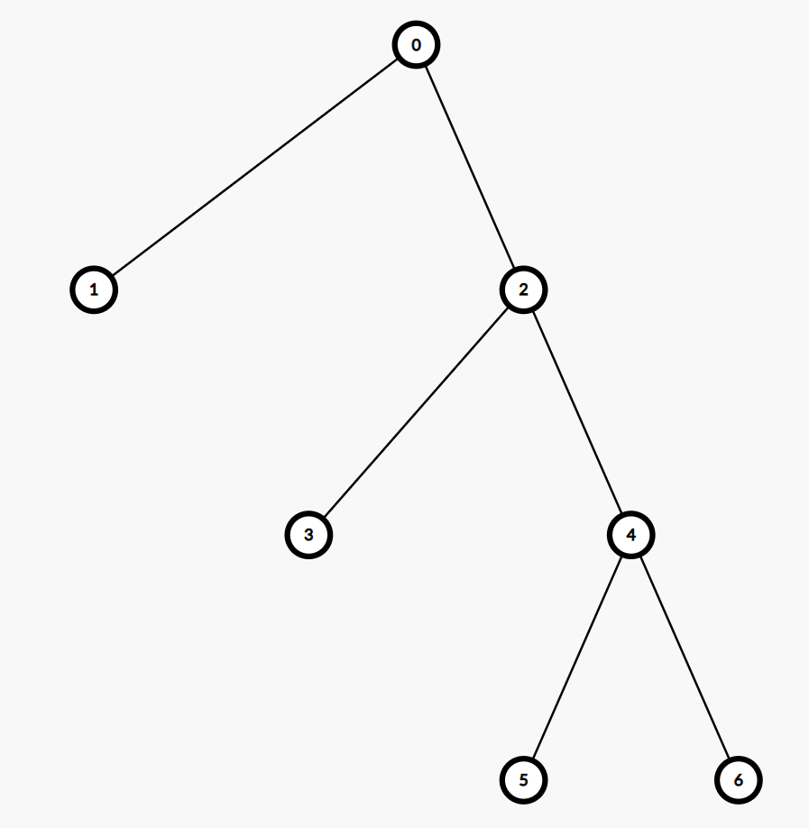

嗯~ o(_￣ ▽ ￣_)课堂测验不会，就像[PuQing 不会啦](https://search.puqing.work)。

---

**第一题**&emsp;&emsp;有$64$个结点的完全二叉树的高度为$____$（根高度为$0$）。

**答：**

&emsp;&emsp;嘿嘿，在[二叉的性质](https://search.puqing.work/study/algorithm/algo7.html#%E6%80%A7%E8%B4%A8)中讲过，一个结点数为$n$的完全二叉树的结点数为$\left \lfloor \log_{2}n \right \rfloor$个，所以

$$H=\left \lfloor \log_{2}64 \right \rfloor=\left \lfloor 8 \right \rfloor=8$$

---

**第二题**&emsp;&emsp;任意一个有$n$个结点的二叉树，已知它有$m$个叶子结点，非叶子结点中度数为$2$的结点$_____$个。

**答：**

&emsp;&emsp;同样在[二叉的性质](https://search.puqing.work/study/algorithm/algo7.html#%E6%80%A7%E8%B4%A8)中讲过，对于二叉树来说，叶子结点与度为$2$的结点有如下关系：

$$n_{0}=n_{2}+1$$

所以

$$n_{2}=m-1$$

---

**第三题**&emsp;&emsp;已知完全二叉树的第$4$层有$8$个结点(根结点在$0$层)，则其叶子结点有$_____$个。

**答：**

&emsp;&emsp;因为第$4$层最多可以有$2^{4}$个结点，所以第$4$层一点不是满的，即第$4$层是从左到右依次排的。所以我们可以画出二叉树。

所以叶子结点有$12$个。

---

**第四题**&emsp;&emsp;对于图中所示的二叉树，其中序遍历得到的结点序列是$_____$， 后序遍历得到的结点序列是$_____$。

&emsp;&emsp;这样的遍历只需要牢记先序遍历、中序遍历、后序遍历的方法就可以了。

&emsp;&emsp;中序遍历是$LNR$，即如下顺序

$$\begin{aligned}
&a_{L}\to b_{L}\to d_{L}(NULL)\to d_{N}(d)\\
&\to d_{R}(g)\to b_{N}(b)\to b_{R}(NULL)\to a_{N}(a)\to a_{R}\\
&\to c_{L}\to e_{L}(NULL)\to e_{N}(e)\to e_{R}(NULL\\
&\to c_{N}(c)\to c_{R}\to f_{L}\to h_{L}(NULL)\\
&\to h_{N}(h)\to h_{R}(NULL)\to f_{N}(f)\to f_{R}(NULL)\end{aligned}$$

&emsp;&emsp;简洁版：

$$d\to g\to b\to a\to e\to c\to h\to f$$

后序不再说明。

---

**第五题**&emsp;&emsp;设高度为$h$（根高度为$0$）的二叉树上只有度为$0$和度为$2$的结点，则此类二叉树中所包含的结点数至少为$_____$。

**答：**

&emsp;&emsp;首先是所求是至少是多少，即最少是多少？

&emsp;&emsp;想到如下结构

&emsp;&emsp;即除根结点以外，每层有两个结点。

&emsp;&emsp;所以答案是$2h+1$.

---

**第六题**&emsp;&emsp;高度为 $k$ 的二叉树其结点数至少有$_____$个（假设根高度为$0$）

**答：**

&emsp;&emsp;很简单，从根结点开始，像链表一样，一条就是最少的，有$k+1$个。

---

**第七题**&emsp;&emsp;已知二叉树有$50$个叶子结点，有$30$个度为$1$的结点，则该二叉树总的结点数是$_____$

**答：**

&emsp;&emsp;这题型就是考结点数的计算

&emsp;&emsp;知二叉树结点树为$n$，度为$0,1,2$的结点数分别为$n_{0},n_{1},n_{2}$

$$\begin{cases}
    n=n_{0}+n_{1}+n_{2}\\
    n_{0}=n_{2}+1
\end{cases}$$

&emsp;&emsp;所以

$$n=2n_{0}-1+n_{1}=129$$
