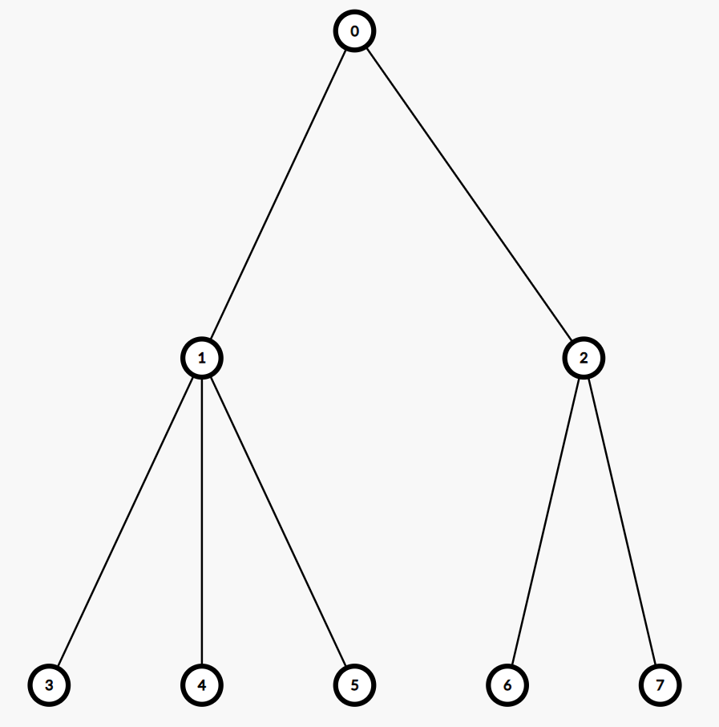
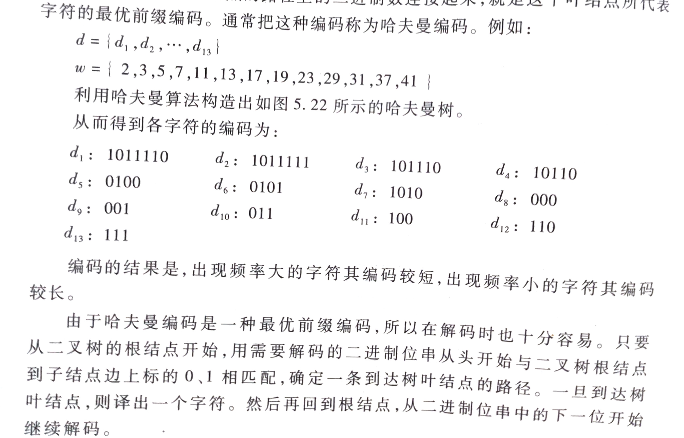
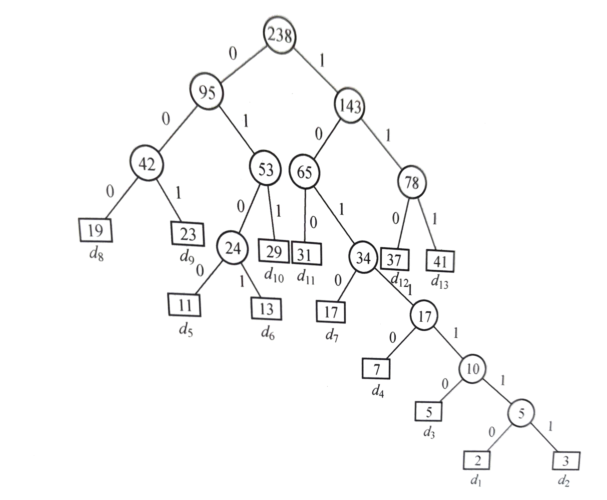
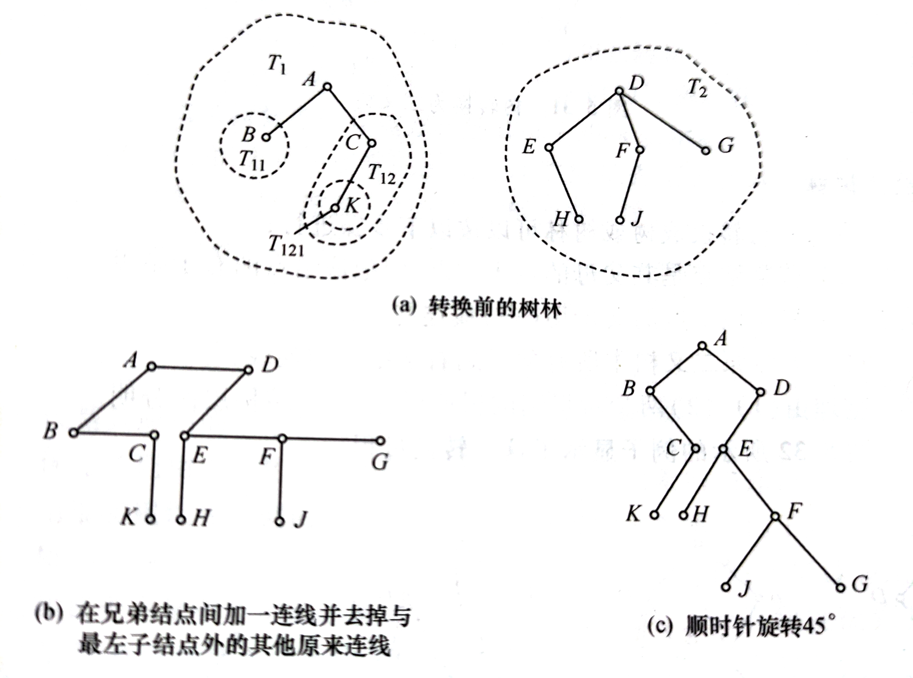
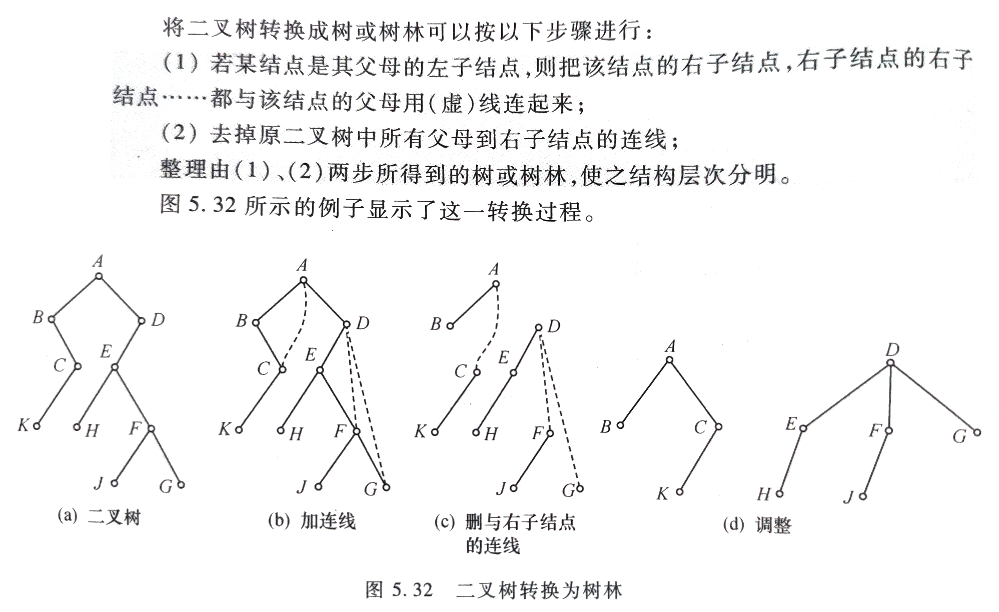

## 树

&emsp;&emsp;因为树没见常见题型，所以这里只是简单说一下树的结构。

&emsp;&emsp;上面是一个常见的树结构，相比于二叉树就是没有了一个结点的度小于等于$2$的限制。

## 哈夫曼树

&emsp;&emsp;介绍哈夫曼树前需要补充几个知识。

### 路径

&emsp;&emsp;在一棵树中，从一个结点到另一个结点所经过的所有结点，被称为两个结点之间的路径

&emsp;&emsp;如图就是根结点$A$到叶子结点$H$的路径，就是$A,B,D,H$

### 路径长度

&emsp;&emsp;在一棵树中，从一个结点到另一个结点所经过的“边”的数量，被称为两个结点之间的路径长度。

&emsp;&emsp;上述例子中，从根结点$A$到叶子结点$H$，共经过了$3$条边，因此路径长度是$3$

### 结点的带权路径长度

&emsp;&emsp;树的每个结点，都可以拥有自己的“权重”

&emsp;&emsp;结点的带权路径长度，是指树的根结点到该结点的路径长度，和该结点权重的乘积。

&emsp;&emsp;假设结点$H$的权重是$3$，从根结点到结点$H$的路径长度也是$3$，因此结点$H$的带权路径长度为$3\times 3=9$

### 数的带权路径长度

&emsp;&emsp;在一棵树中，所有**叶子结点**的带权路径长度之和，被称为树的带权路径长度，也被简称为 **WPL**。

&emsp;&emsp;仍然以这颗二叉树为例，树的路径长度是 $3\times 3 + 6\times 3 + 1\times 2 + 4\times 2 + 8\times 2 = 53$

### 哈夫曼树(Huffman Tree)

> 哈夫曼树（Huffman Tree）是在**叶子结点和权重确定的情况下，带权路径长度最小的二叉树，也被称为最优二叉树。**

&emsp;&emsp;举个详细的例子就是，给定权重分别为$1,3,4,6$的叶子结点，我们应当构建怎样的二叉树，才能保证其带权路径长度最小？

&emsp;&emsp; 原则上，**我们应该让权重小的叶子结点远离树根，权重大的叶子结点靠近树根。**

&emsp;&emsp;如下图构建方式，比之前的方法带权路径小于原树。

### 哈夫曼树的构建

&emsp;&emsp;首先将所有的权重**有序排列**。

&emsp;&emsp;然后选取**最小**以及**次小**的权重作为左子树与右子树，然后将二者之和作为根结点的权重。

&emsp;&emsp;然后将该**权重放入之前的队列**，重新排序，重复上面操作，即可得到最后的**哈夫曼树**

&emsp;&emsp;如图所示。

### 哈夫曼树的应用

&emsp;&emsp;哈夫曼树的最大的应用是可以不均等编码，像对于$BCD$编码是均等编码，每个编码长度都是一样的，而哈夫曼编码是不均等的编码。

&emsp;&emsp;这一部分书上讲的比较详细，这里不再赘述

### 相关计算

::: tip
**定理**&emsp;&emsp;给定$n$个权值的序列，构造出来的$Huffman$树的结点个数是$2n-1$个。

**证明**&emsp;&emsp;根据外部结点比内部结点多一个的性质，而$n$为我们构造出来的外部结点，所以$n+(n-1)=2n-1$
:::

## 树林与二叉树

> 该性质也是重要考点之一。

&emsp;&emsp;在树林（包括树）与二叉树之间有一个自然的一一对应的关系，也就是说，任何树林都唯一地对应一颗二叉树；反过来，任何二叉树都一一地对应到一个树林。

### 树林转化为二叉树

::: warning
首先在所有**相邻的兄弟结点**之间加一条线；然后对**每个非终端结点**，只保留它到其最左子结点的连线，**删去它与其他子结点之间原有的连线**；最后以根结点为轴心，将整棵树顺时针旋转一定角度(如 45°)，使其层次分明。
:::

&emsp;&emsp;这个教程可谓详细又不详细，不详细在没有说明树的左右子树方向性。

&emsp;&emsp;如上是详细的过程。

### 二叉树转化为树林

