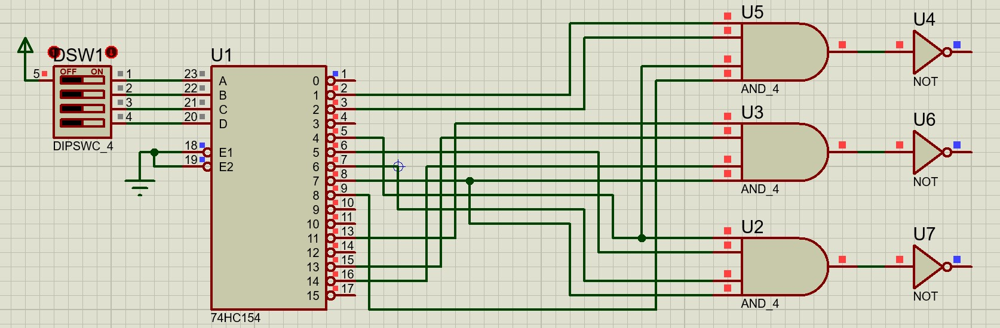
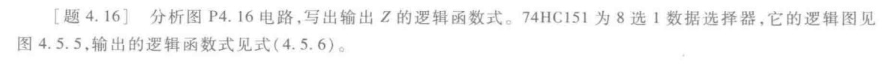
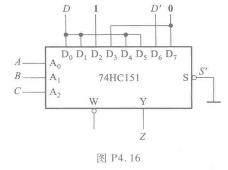
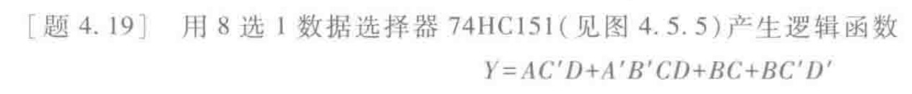
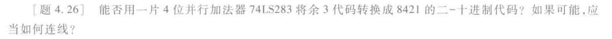
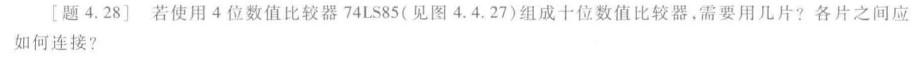
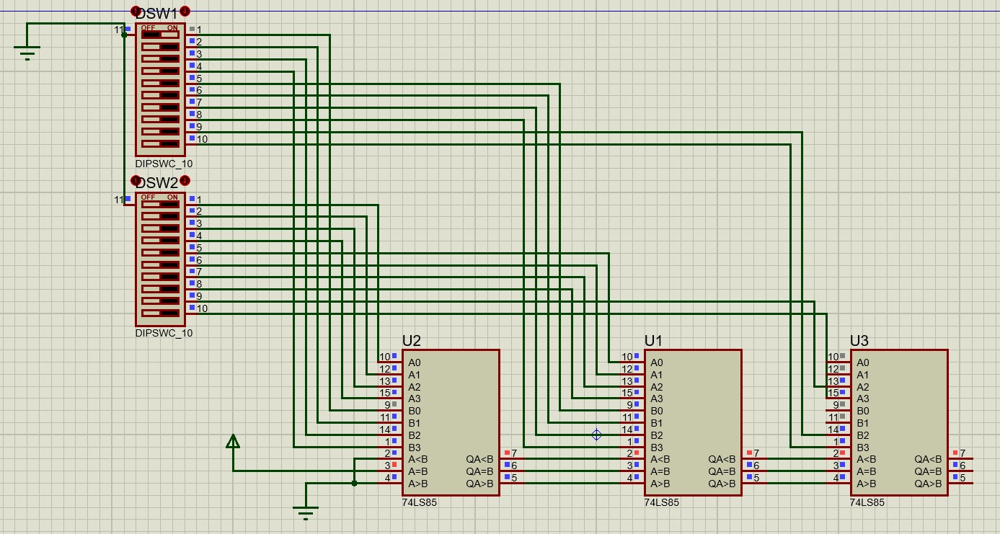

## 4.1 题

分析图 P4.1 电路的逻辑功能，写出输出的逻辑函数式，列出真值表，说明电路逻辑功能的特点。

这种题应该先列出**真值表**，然后观察**真值表**，可得**逻辑功能**、再通过**卡诺图**化简，写**逻辑函数式**

**写出真值表**

|  A  |  0  |  0  |  0  |  0  |  1  |  1  |  1  |  1  |
| :-: | :-: | :-: | :-: | :-: | :-: | :-: | :-: | :-: |
|  B  |  0  |  0  |  1  |  1  |  0  |  0  |  1  |  1  |
|  C  |  0  |  1  |  0  |  1  |  0  |  1  |  0  |  1  |
|  Y  |  1  |  0  |  0  |  1  |  0  |  1  |  1  |  0  |

这样我们可以画出卡诺图，

::: warning
注意卡诺图的画法：相邻项只改变一个值。
**并尽可能画最大的圆**
:::

根据卡诺图我们可以寻找到最简式，可以看到上面无法被化简，即四个最小项。

$$Y=A'B'C'+A'BC+AB'C+ABC'$$

可以看到当三变量为输入**真**为偶数时为**真**和三个都为假时为**真**，所以是一个三变量奇偶检测器。

## 4.6 题

这题的考点是写逻辑条件，然后化简的问题（坑）。

画真值表

画卡诺图（坑来了）

::: warning
注意对于这种应用题，一定要注意有哪些情况是不可能发生的，不可能发生的打叉，并化简时一并考虑
:::

这样写出逻辑函数式

$$M_{L}=A+B$$
$$M_{s}=A+B'C$$

电路图

## 4.10 题

这个$74HC42$芯片是个什么的干活呢，这是个译码器，下面一幅图就懂了。

这就是二进制译码器，将二进制码译成对应的高低电平。

$74HC42$译码器是其中的一种，只不过它将四位二进制译成十进制（10 个变量的高低电平）

再看题目中后面的逻辑电路，问题的关键是什么时候为真。

比如$Z_2$，可以由如下公式表达

$$
\begin{aligned}
Z_{2}&=(Y_{2}Y_{5}Y_{8})'\\
&=Y_{2}'+Y_{5}'+Y_{8}'
\end{aligned}
$$

而注意到芯片外面有小圆圈，即翻转信号，是与上式需要低电平一致的。所以表达成：

$$
\begin{aligned}
Z_{2}&=Y_{2}'+Y_{5}'+Y_{8}'\\
&=M'N'PQ'+M'NP'Q+MN'P'Q'
\end{aligned}
$$

::: tip
这里的换算是由于译码器实际就是输出**最小项**，最小项对应的数字（位数）就是对应的四位二进制的大小而得到的。
:::

上述式子是由最小项构成，自然是与或式。

## 4.11 题

题目已给出关于$S_{A}',S_{B}'$作用，即只有当$S_{A}',S_{B}'$拉低电平时使能。从电路上看，两个使能端为与关系，并是下拉触发。后面的与非门和非门抵消，成为与门。

思路类似于书上的$P.181$上的方式用两片**74HC138**接成**4 线-16 线译码器**。

最后结果为

::: tip
你可能会问你$U2$那里是做什么的呢，又是取非，又是接地。
:::

我们的目的是让高位$W5$成为片选信号，片选很容易理解，就是当$W5$低电平时，选择$U2$芯片，$U2$芯片使能，$U1$芯片失能；当$W5$为高电平时，选择$U1$芯片，$U1$芯片使能，$U2$芯片失能。

根据芯片的使能端口，就是失能时拉高电平，使能时接地(**注意不是悬空!!!!**)。

这就是后面接地的原因。

单独看一下这个电阻吧，当电阻左边是低电平时，接地，为使能；当高电平时，线路连通，又因是同一根导线，电位相同，所以是高电平。

## 4.13 题

这里再用$74LS154$芯片，问题的关键是将每个变量**还原成最小项**，还原成最小项后对应的线。然后用**或门**连接起来。

$$
\begin{aligned}
Y_{1} & = A'B'C'D+A'B'CD'+AB'C'D'+A'BC'D'\\
&=m_{1}+m_{2}+m_{8}+m_{4}\\
Y_{2} & = A'BCD+AB'CD+ABC'D+ABCD'\\
&=m_{7}+m_{11}+m_{13}+m_{14}\\
Y_{3} & = A'B\\
&=m_{4}+m_{5}+\cdots+m_{7}\\
\end{aligned}
$$

然后狂连线就可。

但是在实际使用$EDA$进行模拟时发现并不是简单连线就可，因为译码器输出是$m_{1}',\cdots,m_{7}'$，即当输入对应的数字时，输出的端口是低电平，其他的为高电平。而我们需要的是高电平，所以上面公式需要取反。

$$
\begin{aligned}
Y_{1} & = m_{1}'+m_{2}'+m_{8}'+m_{4}'\\
& = (m_{1}m_{2}m_{4}m_{8})'\\
Y_{2} & = m_{7}+m_{11}+m_{13}+m_{14}\\
& = (m_{7}m_{11}m_{13}m_{14})'\\
Y_{3} & = m_{4}+m_{5}+\cdots+m_{7}\\
& = (m_{4}m_{5}\cdots m_{7})'
\end{aligned}
$$

就变成与非门了。

如上图就是正常工作了。

## 4.16 题

这也可太行了，图$4.5.5$都飞了，也太复杂了。

### 先从数据选择器说起

上图为数据选择器，其中$A_{1}A_{0}$为数据选择端，上图所示的$A_{1}A_{0}=11$为选择$D_{3}$进行输出。

上图为数据选择器的真值表。

那聪明的你肯定想到了如何用四选一组成八选一？？

第一个思路就是增加一个使能端，进行片选，当高位$A_{2}$为 0 时，芯片$(2)$失能，芯片$(1)$使能，从而增加可选择的端口。

讲到这就可以重新认识一下$74HC151$芯片了，$S'$为使能端，低电平有效；$ABC$为地址选择端，高电平有效；$D_{0}D_{1}\cdots D_{7}$数据输入端，$Y$端输出端，$W=Y'$。

根据数据选择器的$Y$输出公式我们可以写出：

$$
\begin{aligned}
Z=Y=D\times m_{0}+D\times m_{1}+1\times m_{2}+0\times D_{3}\\
+D\times D_{4}+D\times D_{5}+D'\times D_{6}+0\times D_{7}
\end{aligned}
$$

如何化简呢，头疼---矣，卡诺图。

那我们似乎可以使用卡诺图的思想进行逻辑化简

$$
Z=Y=D\times B'+A'BC'+D'\times ABC'
$$

emmm,maybe 这就是最简了吧。

## 4.19 题

还是利用 8 选 1$74HC151$，根据前面的思路，我们可以写得如下公式

$$
\begin{aligned}
Y=1\times m_{9}+1\times m_{13}+1\times m_{3}+1\times m_{6}+1\times m_{7}
\\+1\times m_{14}+1\times m_{15}+1\times m_{4}+1\times m_{12}
\end{aligned}
$$

其他的为零乘，我们归纳成$\cdots$

::: tip
不对啊，$74HC151$不是三线寻址吗，不会吧不会吧，不会是两个$74HC151$吧
:::

emmm,似乎可以$embedding$，上面式子保留为

$$
\begin{aligned}
Y=D\times m_{4}+D\times m_{6}+D\times m_{1}+1\times m_{3}
\\+1\times m_{7}+D'\times m_{2}+D'\times m_{6}
\end{aligned}
$$

其余为零，这样就清楚多了。

其中$1\sim 4$为$A\sim D$信号输入

## 4.22 题

好家伙更是重量级。

这种问题的求解重要的是**对状态的编码**，并写出逻**辑函数式**。

题目给出思路，使用两位二进制进行状态编码。

那我们需要寻找$Y$与编码之间的关系，并还原成最小项。画出卡诺图：

写逻辑式，设一人的血型编码为$AB$，另一人编码为$XY$。

$$
\begin{aligned}
Y=AB+XY'+A'B'Y'+BX'Y
\end{aligned}
$$

接下来进行还原同样使用$embedding$方法。令$A_{1}A_{2}A_{3}=ABX,A_{4}=Y$。

$$
\begin{aligned}
Y&=1\times m_{6}+1\times m_{7}+A_{4}'m_{1}+A_{4}'\times m_{3}+A_{4}'\times m_{5}+A_{4}'\times m_{7}\\
&+A_{4}'\times m_{1}+A_{4}'\times m_{0}+A_{4}\times m_{2}+A_{4}\times m_{6}\\
&=A_{4}'\times m_{0}+A_{4}' \times m_{1}+A_{4}\times m_{2}+A_{4}'\times m_{3}+1\times m_{6}+1\times m_{7}
\end{aligned}
$$

于是画出电路图

::: tip
该电路理论上是没问题的，但是实际上是错误的，因为你看当$A_{4}=0$时，非门是悬空的，所以这里应该加个上拉电阻或者下拉电阻。
:::

## 4.26 题

要我说不可能，完！！！

先看看$74LS283$是个啥?这是[来自 TI 的资料](https://www.ti.com.cn/product/cn/SN74LS283?keyMatch=74LS283#params)，全名叫$4-Bit\; Binary\; Full\; Adders\; With\; Fast\; Carry$，说人话就是$#*#*@*#*!@*!@*@*!#$（确信）。其实就是四位超前加法器。

真值表如图所示。

所以$A1-4,B1-4$为二进制加数与被加数，$C0/CI$为低位进位，$\displaystyle \sum_{0-3}$为结果，$C0/C4$为产生的进位。

那余 3 码又是何物，链接[余三码](https://baike.baidu.com/item/%E4%BD%99%E4%B8%89%E7%A0%81/5016629#:~:text=%E4%BD%99%E4%B8%89%E7%A0%81%EF%BC%88%E4%BD%993%E7%A0%81%EF%BC%89%E6%98%AF%E7%94%B1%208421BCD%E7%A0%81,%E5%8A%A0%E4%B8%8A0011%E5%BD%A2%E6%88%90%E7%9A%84%E4%B8%80%E7%A7%8D%20%E6%97%A0%E6%9D%83%E7%A0%81%20%EF%BC%8C%E7%94%B1%E4%BA%8E%E5%AE%83%E7%9A%84%E6%AF%8F%E4%B8%AA%E5%AD%97%E7%AC%A6%E7%BC%96%E7%A0%81%E6%AF%94%E7%9B%B8%E5%BA%94%E7%9A%848421%E7%A0%81%E5%A4%9A3%EF%BC%8C%E6%95%85%E7%A7%B0%E4%B8%BA%E4%BD%99%E4%B8%89%E7%A0%81%E3%80%82)

那结果很明显了，余三码就是从$3$开始，所以只需要余三码减$3$就好了。但是但是，这$TM$是加法器，做个$der$的减法。但是回想前几节课的补码似乎又开朗起来。

我们只要产生溢出就可。也就是加$(13)_{10}=(1101)_{2}$。

嗯，突然合理很多。

## 4.28 题

老规矩：比较器是个啥

如图是一个一位的比较器，若$A>B$则上面输出$1$，若$A=B$则中间输出$0$，若$A<B$则下面输出$1$。

级联输入是来自低位的比较结果，用于多片相连的情况。

上面是它的接线图

$finish$