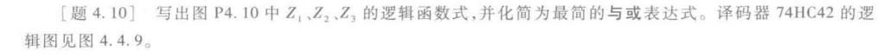
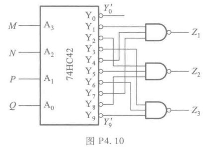
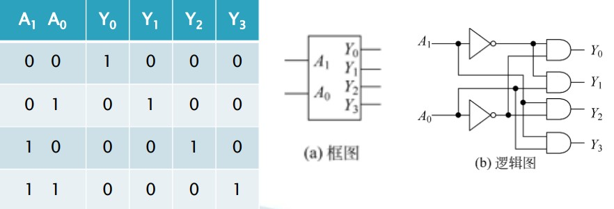
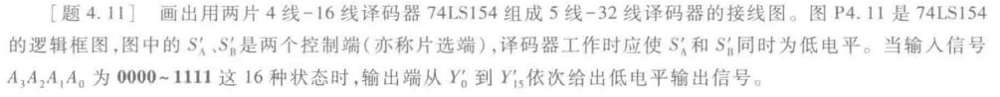
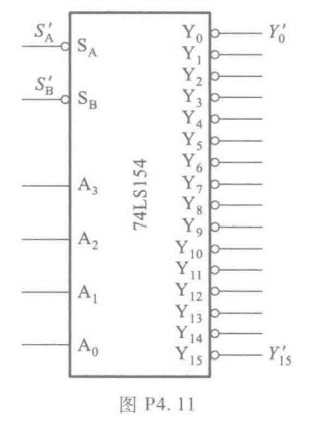

## 4.1 题

分析图 P4.1 电路的逻辑功能，写出输出的逻辑函数式，列出真值表，说明电路逻辑功能的特点。

这种题应该先列出**真值表**，然后观察**真值表**，可得**逻辑功能**、再通过**卡诺图**化简，写**逻辑函数式**

**写出真值表**

|  A  |  0  |  0  |  0  |  0  |  1  |  1  |  1  |  1  |
| :-: | :-: | :-: | :-: | :-: | :-: | :-: | :-: | :-: |
|  B  |  0  |  0  |  1  |  1  |  0  |  0  |  1  |  1  |
|  C  |  0  |  1  |  0  |  1  |  0  |  1  |  0  |  1  |
|  Y  |  1  |  0  |  0  |  1  |  0  |  1  |  1  |  0  |

这样我们可以画出卡诺图，

::: warning
注意卡诺图的画法：相邻项只改变一个值。
**并尽可能画最大的圆**
:::

根据卡诺图我们可以寻找到最简式，可以看到上面无法被化简，即四个最小项。

$$Y=A'B'C'+A'BC+AB'C+ABC'$$

可以看到当三变量为输入**真**为偶数时为**真**和三个都为假时为**真**，所以是一个三变量奇偶检测器。

## 4.6 题

这题的考点是写逻辑条件，然后化简的问题（坑）。

画真值表

画卡诺图（坑来了）

::: warning
注意对于这种应用题，一定要注意有哪些情况是不可能发生的，不可能发生的打叉，并化简时一并考虑
:::

这样写出逻辑函数式

$$M_{L}=A+B$$
$$M_{s}=A+B'C$$

电路图

## 4.10 题

这个$74HC42$芯片是个什么的干活呢，这是个译码器，下面一幅图就懂了。

这就是二进制译码器，将二进制码译成对应的高低电平。

$74HC42$译码器是其中的一种，只不过它将四位二进制译成十进制（10 个变量的高低电平）

再看题目中后面的逻辑电路，问题的关键是什么时候为真。

比如$Z_2$，可以由如下公式表达

$$
\begin{aligned}
Z_{2}&=(Y_{2}Y_{5}Y_{8})'\\
&=Y_{2}'+Y_{5}'+Y_{8}'
\end{aligned}
$$

而注意到芯片外面有小圆圈，即翻转信号，是与上式需要低电平一致的。所以表达成：

$$
\begin{aligned}
Z_{2}&=Y_{2}'+Y_{5}'+Y_{8}'\\
&=M'N'PQ'+M'NP'Q+MN'P'Q'
\end{aligned}
$$

::: tip
这里的换算是由于译码器实际就是输出**最小项**，最小项对应的数字（位数）就是对应的四位二进制的大小而得到的。
:::

上述式子是由最小项构成，自然是与或式。

### 4.11 题

题目已给出关于$S_{A}',S_{B}'$作用，即只有当$S_{A}',S_{B}'$拉低电平时使能。从电路上看，两个使能端为与关系，并是下拉触发。后面的与非门和非门抵消，成为与门。

思路类似于书上的$P.181$上的方式用两片**74HC138**接成**4 线-16 线译码器**。

最后结果为

::: tip
你可能会问你$U2$那里是做什么的呢，又是取非，又是接地。
:::

我们的目的是让高位$W5$成为片选信号，片选很容易理解，就是当$W5$低电平时，选择$U2$芯片，$U2$芯片使能，$U1$芯片失能；当$W5$为高电平时，选择$U1$芯片，$U1$芯片使能，$U2$芯片失能。

根据芯片的使能端口，就是失能时拉高电平，使能时接地(**注意不是悬空!!!!**)。

这就是后面接地的原因。

单独看一下这个电阻吧，当电阻左边是低电平时，接地，为使能；当高电平时，线路连通，又因是同一根导线，电位相同，所以是高电平。

### 4.13题

这里再用$74LS154$芯片，问题的关键是将每个变量还原成