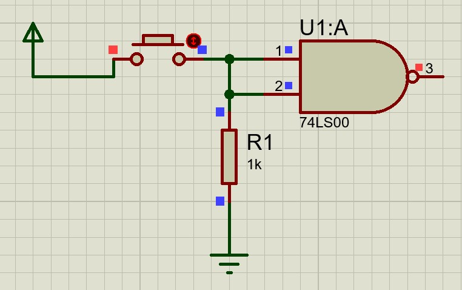
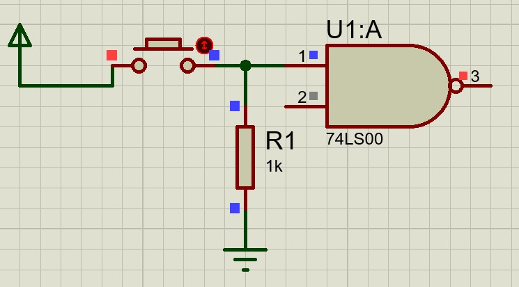
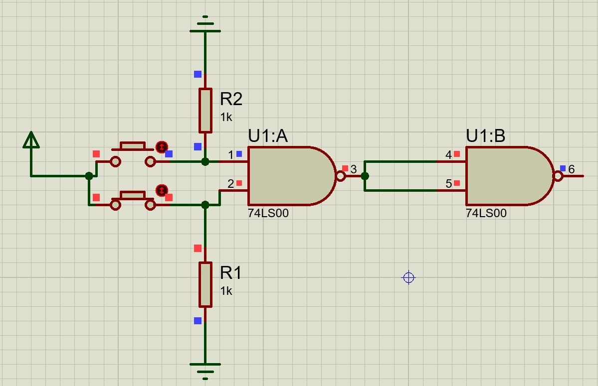
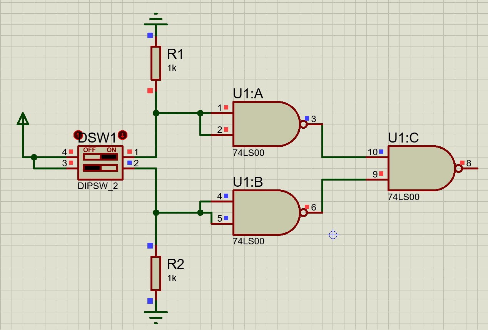

## 有芯片我就不用，欸，我就用与非门

::: tip

在数字逻辑试验中，老师不会给利用非门，或门，只会给你用与非门$74LS00$芯片，所以归纳一下使用该芯片完成其他逻辑门的技巧

:::

## 非门

与非门的逻辑式是
$$
Y=(AB)'
$$
那自然而言，只要令$A=B$即可转化为非门。
$$
Y=(AA)'=A'
$$

那还有什么方案吗，有的：令一个输入置高电平（悬空），数学表达为
$$
Y=(1\cdot A)'=A'
$$

一样可以完成任务

## 与门

根据上面思路将一个与非门的信号取反即可

## 或门

首先是写出或门的逻辑式
$$
Y=A+B
$$
然后运算转化为与非式
$$
Y=(A+B)''=(A'B')'
$$
这就可以转化了

