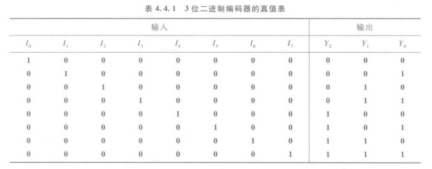
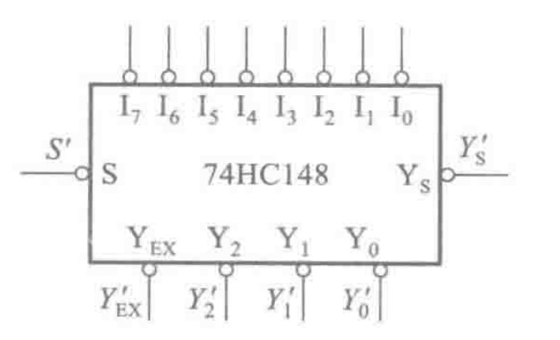
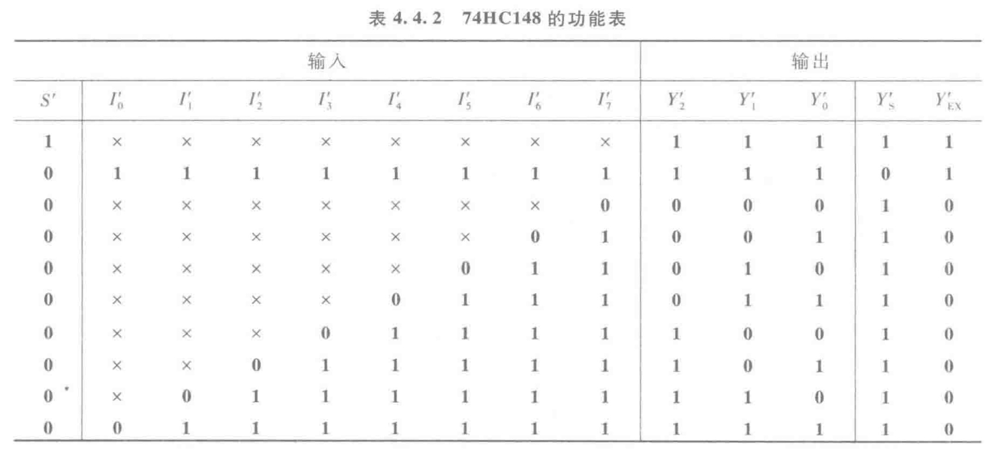
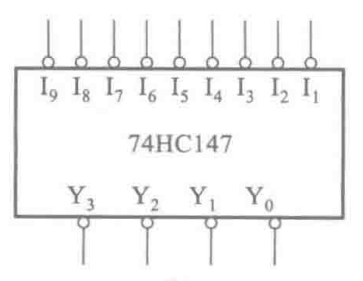
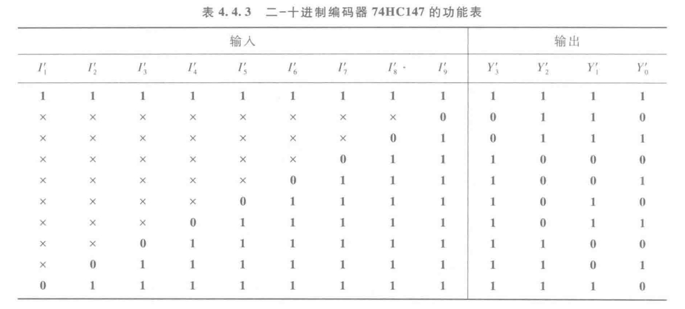

&emsp;&emsp;编码器是将输入信号信息转换为一个对应的二进制代码，简单来讲就是把一个十进制数转换为一个二进制数。

&emsp;&emsp;主要有如下种类

- 输入互相排斥的编码器(普通编码器)
- 优先编码器

## 普通编码器

&emsp;&emsp;普通编码器任何时刻只允许一个编码信号，否则将不符合定义。

&emsp;&emsp;以一个三位二进制普通编码器为例，根据上面式子我们可以列出真值表。

&emsp;&emsp;根据上面真值表可以写出逻辑表达式，并化简得到
$$
\begin{cases}
Y_{2}=I_{4}+I_{5}+I_{6}+I_{7}\\
Y_{1}=I_{2}+I_{3}+I_{6}+I_{7}\\
Y_{0}=I_{1}+I_{3}+I_{5}+I_{7}
\end{cases}
$$
&emsp;&emsp;根据表达式我们就可以画出电路图。

::: warning

这里强调的是哪一路是高位，哪是低位，在上面编码器中$Y_{2}Y_{1}Y_{0}$由高位到低位，$I_{1}I_{2}\cdots I_{7}$依次由低到高，并且信号转化后$Y_{2}Y_{1}Y_{0}$数值上代表，$I_{i}$的下标（从$1$开始）

:::

## 优先编码器

### 74HC148

&emsp;&emsp;以上编码器的缺点很明显，就是无法正确编码同时输入的情况。

&emsp;&emsp;由于$74HC148$的内部结构复杂，这里先只谈$74148$的使用

::: tip 

$S'$为使能端口，且低电平有效。

$Y'_{s}$为编码器状态指示变量，其低电平信号含义为"电路工作，但无编码输入"

$Y'_{EX}$为也为编码器状态指示变量，其低电平含义为"电路工作，并且有编码输入"

> 电路工作是指使能了

:::

&emsp;&emsp;如下图是$74148$的真值表

::: tip

竖看，只有$S'$为零才工作，且状态变量为高电平

横看，当全部为$1$，即没有$0$，这时无编码，状态变量$Y'_{s}$低电平

**同时注意到该芯片输出是无法将输入的信号的下标与$Y_{2}Y_{1}Y_{0}$组成的二进制编码对应起来的，这是因为$Y_{2}Y_{1}Y_{0}$进行了反向**，低电平输出为真。**所以只需要进行取非即可。**

:::

### 74HC147

$74HC147$也是一块优先编码器但是逻辑的定义不一样

::: tip

很明显的是该芯片的输入下标是从$1$开始的，并且输出的$Y_{3}Y_{2}Y_{1}Y_{0}$取非后，并不从$0$开始，但是是从$1$开始的

> 关于这样做的解释：注意到有一种无效的输入就是全部是$1$的情况（该信号的输出全部为$1$），而将开始的值移到从$1$开始；则省掉了两个状态变量的指示信号。

一样的是都是取反后等于输入优先变量的下标。

:::

