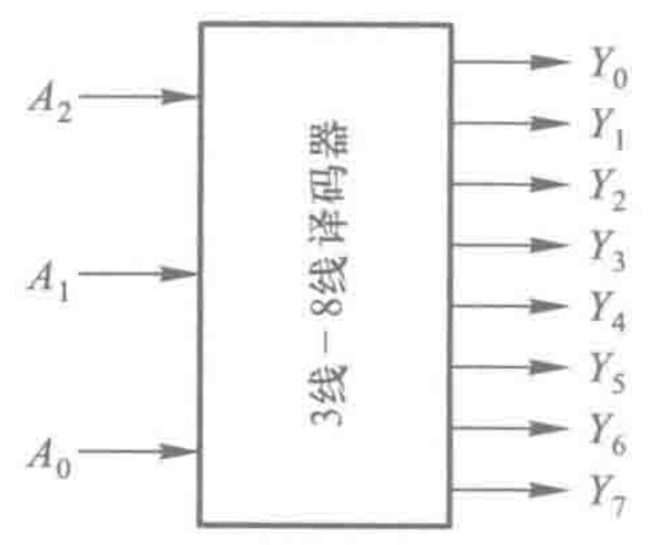
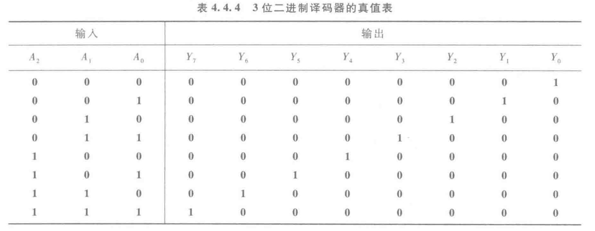
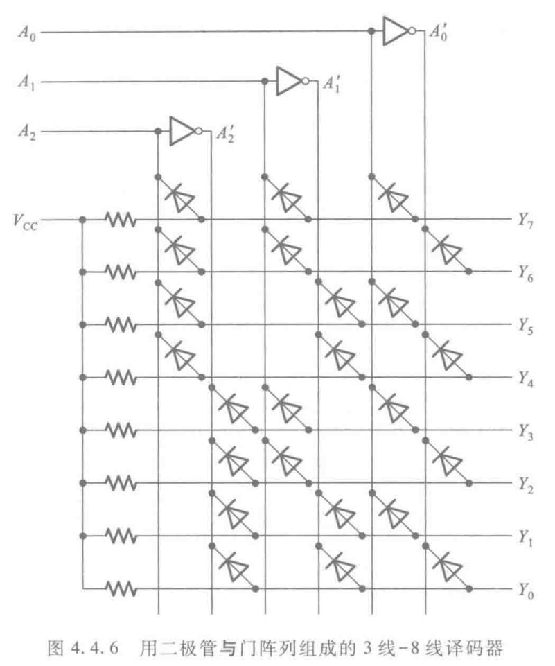
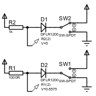
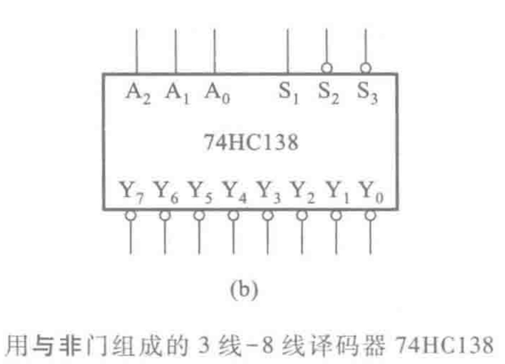

&emsp;&emsp;译码器是编码器的相反操作，即将二进制的编码翻译成单独的一个变量（形象化体现在输出变量的下标等于二进制对应的十进制）。

### 二极管与门阵列组成的3-8译码器

如图是使用二极管与门阵列组成的$3-8$译码器，其逻辑图很好懂。

如图是上述译码器的真值表，其与编码器的输出不一样的是高电平有效(注意观察芯片上端口名有无$'$符号)

其具体实现这里要解释一下，因为在后面有用。

如图是一个用二极管**与门**阵列组成的$3$线-$8$线译码器，但是实现逻辑还是挺朴素的。

注意到译码器的逻辑函数可以写为
$$
\begin{aligned}
Y_{0}=A_{2}'A_{1}'A_{0}'\\
Y_{1}=A_{2}'A_{1}'A_{0}\\
\vdots \qquad \quad  \\
Y_{7}=A_{2}A_{1}A_{0}
\end{aligned}
$$
在结构之前首先需要补充一个知识：

如上图是该结构核心原理，当$D2$二极管的左边是低电平时，二极管导通，从而形成**管压降**，所以从**检测点**输出的电压只有$0.6574V$，因此此时已可认为是低电平。

::: tip
让我们聚集于$Y_{7}$的连接点$A_{2}$、$A_{1}$、$A_{0}$。无连接任何线的情况下$Y_{7}$是高电平的（是一条导线）；当**任意之一连接点**的二极管导通（即$A_{2}$、$A_{1}$、$A_{0}$任意之一为低电平）则输出为低电平。所以$Y_{7}$输出高电平的条件是$A_{2}$、$A_{1}$、$A_{0}$高电平。其他类似分析即可。其数学表达如下
$$
Y_{7}=A_{2}A_{1}A_{0}
$$
这也说明了为什么叫做二极管构成的**与门矩阵**

:::

### 74HC138

> [SN74HC138 数据表, 产品信息与支持](https://www.ti.com.cn/product/cn/SN74HC138?keyMatch=&tisearch=search-everything&usecase=partmatches)

$74HC138$是用$CMOS$门电路做的。一样不说具体实现，只写使用。

下图是芯片的逻辑框图以及真值表。

> 这里的真值表是盗的TI芯片的资料，跟书上的不一样，$\bar{G2A}=S_{2}',\;\bar{G2B=}S_{3}',\;G1=S_{1},\;CBA=A_{2}A_{1}A_{0}$，同时$S_{1}$与$S_{2}',S_{3}'$为附加控制端，只有当$S_{1}$为高电平，$S_{2}'+S_{3}'=0$时（即都为低电平），芯片正常工作，其中$S_{2}',\;S_{1}'$可以作为片选信号进行拓展。

::: tip

注意输出是低电平有效

:::

