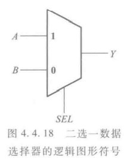
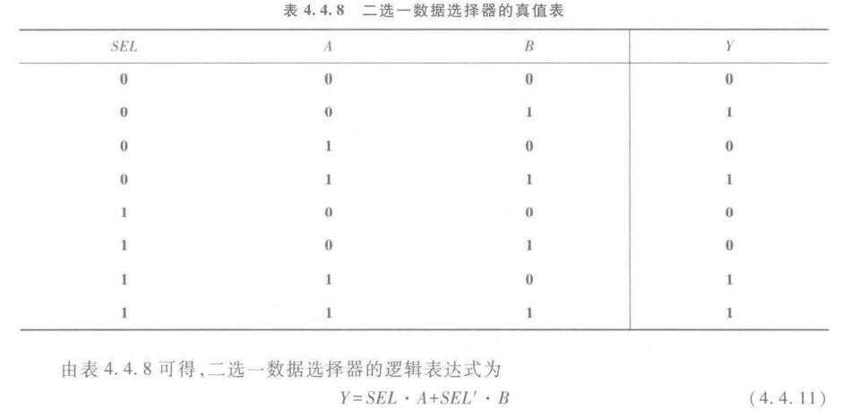
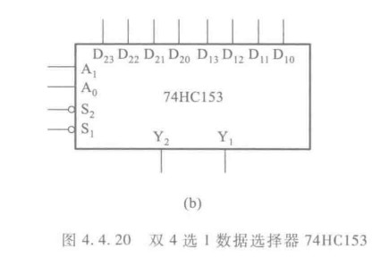

## 数据选择器

&emsp;&emsp;直接来

&emsp;&emsp;数据选择器就像单刀双置开关一样，可以选择那一条数据作为输出数据。

&emsp;&emsp;同样的道理我们可以构建四选一数据选择器。

## 74HC153

&emsp;&emsp;如上图是双4选1数据选择器，其逻辑式可以写出
$$
Y_{1}=[D_{10}(A_{1}'A_{0}')+D_{11}(A_{1}'A_{0})+D_{12}(A_{1}A_{0}')+D_{13}(A_{1}A_{0})]\cdot S_{1}
$$
&emsp;&emsp;为什么说是双呢，因为这个芯片可以通过选择$S_{1},\;S_{2}$端口来激活哪一个4选1数据选择器，低电平有效，其实也可称为是8选1。

&emsp;&emsp;数据选择器常常可以用于产生逻辑函数。并且考点是降维的方法。之后会进行归纳。

