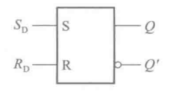
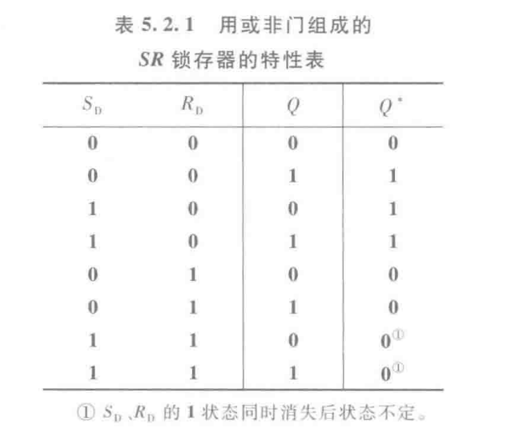
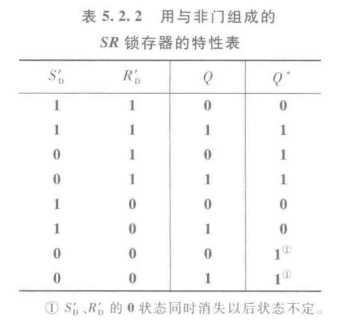
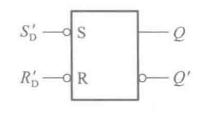

&emsp;&emsp;SR 锁存器是静态存储单元最基本的结构。通常由两个或非门，或者与非门构成。

&emsp;&emsp;如上图是一个典型的$SR$**锁存器**，逻辑符号如下

&emsp;&emsp;其中$S_{D}$为置$"1"$端，拉高电平会，将输出$Q=1$；$R_{D}$为置$"0"$端，高电平，输出端口$Q=0$，

&emsp;&emsp;有如下真值表

&emsp;&emsp;其实这里我们可以写出$SR$触发器的**特征方程**：

$$\begin{cases}Q^{*}=S+R'Q\\SR=0\end{cases}$$

&emsp;&emsp;同样的有用与非门做的$SR$的触发器，其真值表与或非门做的相反。

&emsp;&emsp;值得注意的是其逻辑符号也有了变化

::: tip
原来是高电平有效，而这里是低电平有效，所以在芯片的外面有**小圆圈**，但是输出没有翻转噢。
:::

