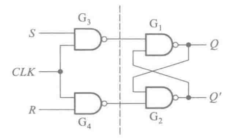
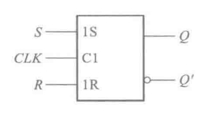
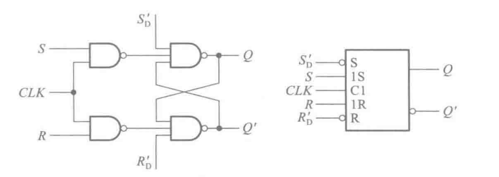
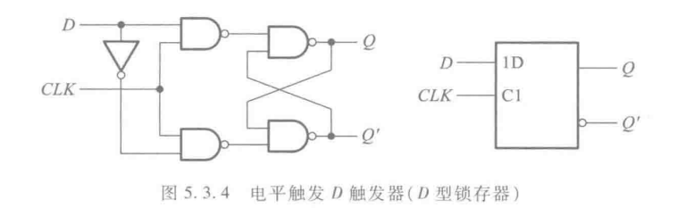
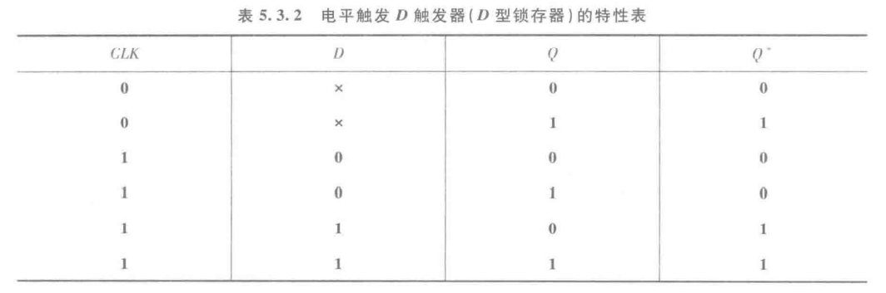
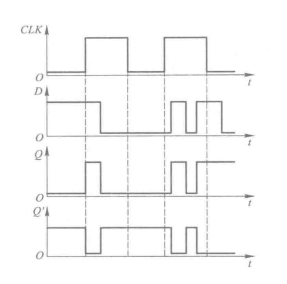
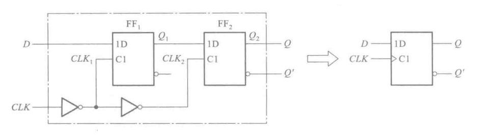
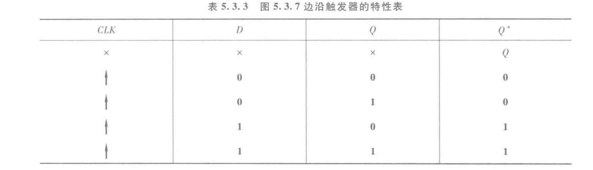
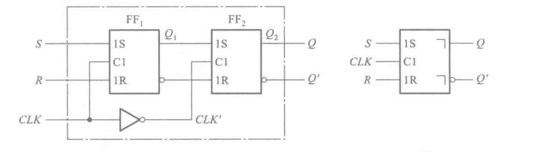

&emsp;&emsp;触发器与锁存器不一样的地方在于，多了一个**时钟信号**($\mathbf{CLOCK}$)，记作$\mathbf{CLK}$，只有该信号满足一定条件才会响应。

&emsp;&emsp;而该种条件为触发条件，下面是常见的几种**触发方式**。

## 电平触发的触发器

### 电平触发 SR 触发器

&emsp;&emsp;上图就是一个有时钟信号的$SR$触发器。

> 简要分析一下，后面的与非门$SR$锁存器，是**低电平有效**。则前面部分，需要低电平信号，而对于一个与非门来说，只有当两个信号都为高电平才会输出低电平，所以只有$CLK$信号是高电平才会工作。
> ::: tip
> 这里衍生一个问题，为什么不用或门型$SR$锁存器做呢？之后会进行讨论（$maybe$）
> :::

::: tip
所以归纳一下，电平触发就是只有在$CLK$信号是高电平才**工作/使能**，在工作时，$S/R$端口变化输出就会变化。
:::

&emsp;&emsp;其逻辑符号如上所示。值得提一句的是对于方框内的命名的规范。$1S$是指受$C1$控制的输入信号，且$CLK$接入处有小圆圈代表是低电平**使能**

&emsp;&emsp;下面是一种异步的置位，复位端的电平触发$SR$触发器，虽然异步可能不是重要的，但是作为一种方法，第一次出现说一下

::: tip
从大体来看跟电平触发$SR$触发器没什么两样，只是在后面的与门$SR$锁存器加了一根线，这就意味着，信号不需要等$CLK$信号来，就可以直接控制触发器。从这点上看这便是**异步**，其中$S_{D}'$为异步置（1）端，原理很简单$0\times X=0$，即会一直触发置位。另一端也是这样。
:::

### D 触发器

&emsp;&emsp;有时候为了方便，我们把$S$和$R$用非连接起来。

&emsp;&emsp;这样够成的真值表为

> 其特点是在$CLK$有效期间，输出状态始终跟随输入状态的变化，输出与输入相同，所以又叫“透明的$D$型锁存器”

&emsp;&emsp;上面说的用一个图就知道了

## 边沿触发的触发器

### 边沿 D 触发器

&emsp;&emsp;上面解释的**电平触发器**在$CLK$使能期间是可以随设置信号变化的。这降低了信号的稳定性，所以为了改善这种弊端，设计了边沿触发器，只有在特定时候触发。

&emsp;&emsp;不妨先假设$CLK$信号为$0$，这时$FF_{1}$触发器为使能状态；$FF_{2}$为保持状态，这时$Q_{1}$的信号状态与$D$一致。当$CLK$跳变到$1$时，$FF_{1}$保持；$FF_{2}$使能。则$Q$与$Q_{1}$保持一致。

> 为什么说它具有极好的稳定性呢？因为在$FF_{2}$的输出信号只能从在$CLK$低电平时进行改变，而在高电平时通过$D$触发器进行保持。所以能有稳定性。

::: tip
该有一个重要的点就是逻辑符号中的箭头为上升沿有效。
:::

&emsp;&emsp;下面是其真值表

::: tip
总结一下边沿触发器：其特点是触发器的次态仅取决于时钟信号的上升沿或下降沿**到达时**输入的逻辑状态，在这之后没有影响。
:::

> 聪明的你能构建一个下降沿的触发器吗？

## 脉冲触发器

&emsp;&emsp;类似与边沿触发器，当$CLK=0$时$Q_{1}$保持不变，则$Q$也不变。

> 注意到$FF_{2}$的$1R$是接在$FF_{1}$的$Q_{1}'$上的，所以实际上$FF_{2}$为一个$D$触发器。状态跟$Q_{1}$相同

&emsp;&emsp;当$CLK=1$时，$FF_{1}$是使能状态，其$S,R$可控制$Q_{1}$的状态，但是这时的$FF_{2}$是保持状态，所以没有变化；

&emsp;&emsp;当$CLK$再次等于$0$时，$FF_{2}$被激活，输出等于$Q_{1}$

> 综合上述过程，脉冲触发有如下特点，
