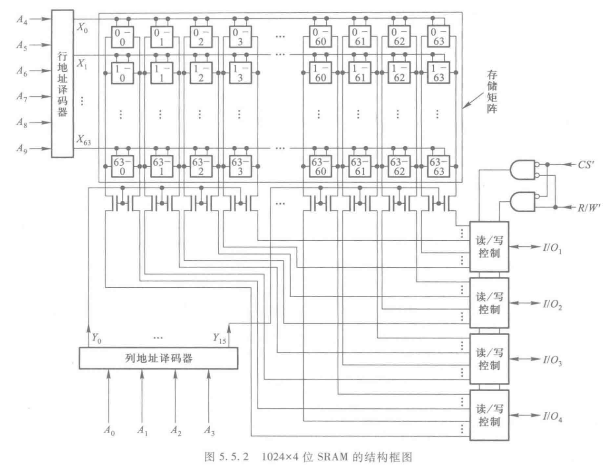
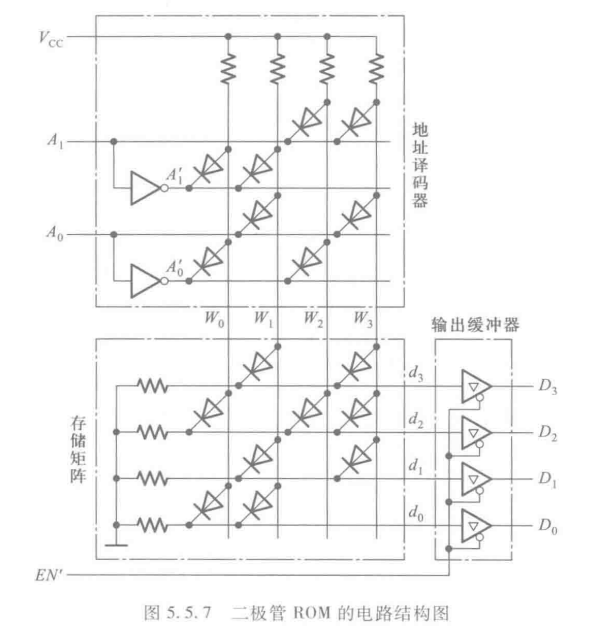
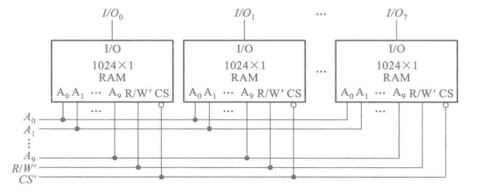

## 随机存储器

### SRAM 的静态存储单元

&emsp;&emsp;如下是$SRAM$的储存结构，虽然不怎么考它的结构，但是它的容量的单元的表示是需要了解的。

&emsp;&emsp;上图是一个$1024\times 4$位的$SRAM$的结构图，其中$1024$是指我们能**寻址到$1024$个地址**，$4$代表每个地址对应 $4$ 个**存储单元**。所以该$SRAM$的容量是$1024 \times 4$个**存储单元**。

&emsp;&emsp;因为有$1024$个地址，所以$SRAM$的控制线的数量是$\log_{2}1024=10$。在该结构中，$A_{4}\sim A_{9}$选择储存矩阵的行，$A_{0}\sim A_{3}$选择前者选择的行中的列对应的$4$个存储单元。

### ROM 只读存储器

&emsp;&emsp;在某些情况在，只需要存储一些固定的数据，而不需要对其进行更新，这时候就可以使用**ROM**。

&emsp;&emsp;$ROM$具有非常简单的结构，其原理来源于[二极管与门阵列组成的 3-8 译码器](https://search.puqing.work/study/mathlogic/logic3.html#%E4%BA%8C%E6%9E%81%E7%AE%A1%E4%B8%8E%E9%97%A8%E9%98%B5%E5%88%97%E7%BB%84%E6%88%90%E7%9A%843-8%E8%AF%91%E7%A0%81%E5%99%A8)。文中讲的非常详细了。

&emsp;&emsp;在$ROM$上方是一个译码器，将$2$位的地址转化为$4$个最小项。最后的存储矩阵其实就是前面文章中说到的用二极管矩阵构建一个函数。

## 储存器容量的拓展

&emsp;&emsp;如果当使用一片$ROM$或者$RAM$器件不能满足时，就需要将若干片$ROM$或者$RAM$组合起来，形成一个更大的存储器。

### 位拓展方式

&emsp;&emsp;如果一片$ROM$或者$RAM$中的字数已经够用，但是每个字的位数不够用时，举个例子，一个$float$类型需要$4$个字节储存，但是如果你的存储器的位数不足$4$个字节，就非常麻烦。所以需要进行位拓展。

&emsp;&emsp;如上图就是如何进行位拓展。用$8$片$1024\times 1$位的$RAM$接成了一个$1024\times 8$位的$RAM$。

&emsp;&emsp;连接方法就是，将八片的所有的地址线、$R/W'$、$CS'$分布并联起来就行了。

### 字拓展方式

&emsp;&emsp;如果每一片存储器的数据位数够用，而字节不够用，则需要采用字拓展的方式，将多片存储器接成一个字数更多的存储器。

&emsp;&emsp;下图是用字拓展的方式将$4$片$256\times8$位的$RAM$接成一个$1024\times8$位的$RAM$的例子。因四片中共有$1024$个字，所以需要$10$根地址线进行寻址，而片拓展最常用的方法就是加片选信号，但是$256\times8$原本是$8$位地址线，也就说通过$2$根地址线片选$4$片$RAM$，所以我们需要$2$线-$4$线译码器，将$2$根地址转换为$4$位的
