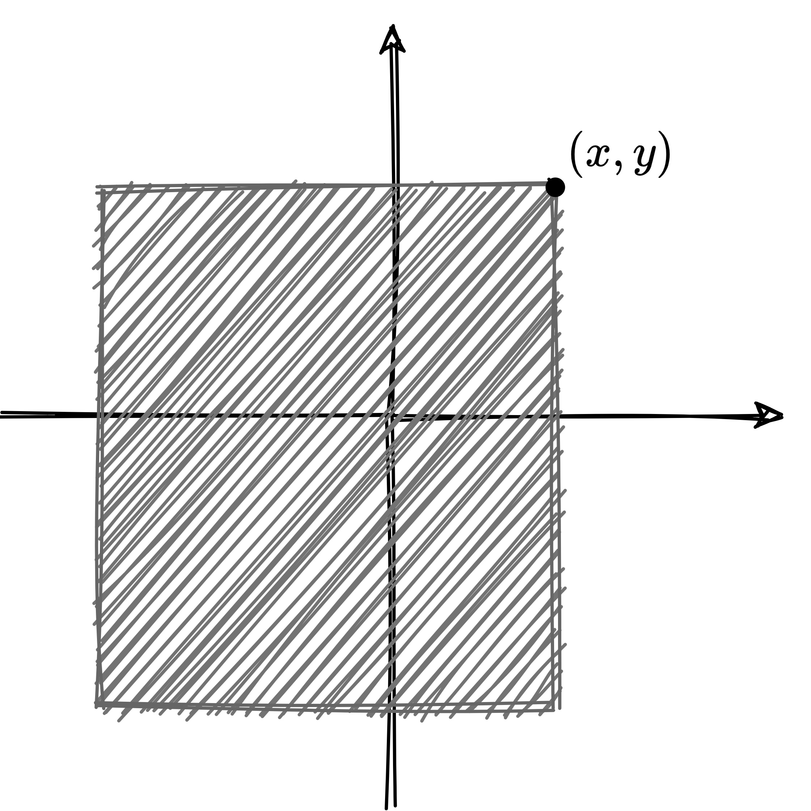
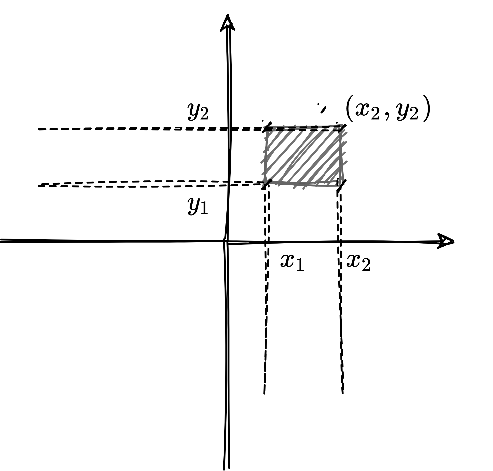
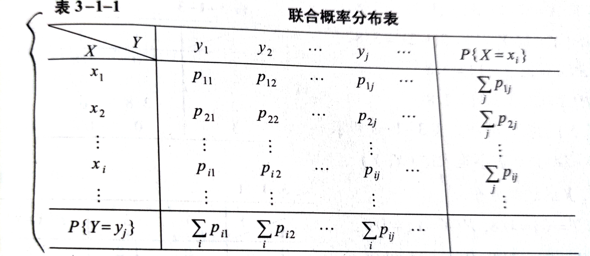

## 二维随机变量

设随机试验的样本空间为$S$，$\omega\in S$为样本点，而
$$
X=X(\omega),\quad Y=Y(\omega)
$$
是定义在$S$上的两个随机变量，称$(X,Y)$为定义在$S$上的**二维随机变量**或**二维随机向量**。

## 二维随机变量的分布函数

想在一维随机变量中一样，我们如下定义二维随机变量的分布函数，设$(X,Y)$是二维随机变量，对任意实数$x,y$，二元函数
$$
F(X,Y)=P\{(X\le x)\cap(Y\le y)\}= P\{X\le x,Y\le y\}
$$
称为二维随机变量$(X,Y)$的**分布函数**，或为随机变量$X$和$Y$的**联合分布函数**

若将二维随机变量$(X,Y)$视为平面上随机点的坐标，则分布函数
$$
F(x,y)=P\{X\le x,Y\le y\}
$$
就是随机点$(X,Y)$落入区域$\{(t,s)\mid t\le x,s\le y\}$的概率。（如下图）

那若要计算矩形区域$(x_{1}<x\le x_{2},y_{1}<y\le y_{2})$的概率为

$$
\begin{aligned}
P\{x_{1}<&X\le x_{2},\quad y_{1}<Y\le y_{2}\}\\
&=F(x_{2},y_{2})-F(x_{2},y_{1})-F(x_{1},y_{2})+F(x_{1},y_{1})
\end{aligned}
$$

若已知$(X,Y)$的分布函数$F(x,y)$，则可由$F(x,y)$导出$X$和$Y$各自的分布函数$F_{X}(x)$和$F_{Y}(y)$：
$$
\begin{aligned}
F_{X}(x)=P\{X\le x\}=P\{X\le x,Y<+\infty\}=F(x,+\infty),\\
F_{Y}(y)=P\{Y\le y\}=P\{X < +\infty,Y\le y\}=F(+\infty,+y),\\
\end{aligned}
$$
分别称$F_{X}(x)$和$F_{Y}(y)$为$F(x,y)$关于$X$和$Y$的边缘分布函数。

::: tip

该公式之后看离散和连续型会更好理解

:::

## 二维离散型随机变量及其概率分布

> 若二维随机变量$(X,Y)$只取有限个或可数个值，则称$(X,Y)$为二维离散型随机变量。

若二维离散型随机变量$(X,Y)$所有的可能的取值为$(x_{i},y_{j}),i,j=1,2,\cdots,$则称$P\{X=x_{i},Y=y_{i}\}=p_{ij}(i,j=1,2,\cdots)$为二维离散型随机变量$(X,Y)$的**概率分布（分布律）**，或$X$与$Y$的联合概率分布。与一维类似的，联合概率分布可以用表格表示，并称其为**联合概率分布表**

::: warning

对于离散型随机变量而言 ，联合概率分布不仅比联合分布函数更加直观，而且能够更加方便的确定$(X,Y)$取值与任意区域$D$上的概率，即
$$
P\{(X,Y)\in D\}=\sum_{(x_{i},y_{j})\in D}p_{ij}.
$$
特别地，由联合概率分布可以确定联合分布函数：
$$
F(x,y)=P\{X\le x,Y\le y\}=\sum_{x_{i}\le x,y_{i}\le y}p_{ij}
$$
由$X$和$Y$的联合概率分布，可求出$X,Y$各自的概率分布：
$$
\begin{aligned}
p_{i}=P\{X=x_{i}\}=\sum_{j}p_{ij},\quad i=1,2,\cdots\\
p_{j}=P\{Y=y_{j}\}=\sum_{i}p_{ij},\quad i=1,2,\cdots\\
\end{aligned}
$$
称$p_{i}(i=1,2,\cdots)$和$p_{j}(j=1,2,\cdots)$为$(X,Y)$关于$X$和$Y$的边缘概率分布

::: 

::: danger

这里特别强调，联合概率分布和联合概率函数（分布函数）是不一样的，重点是后面有没有函数二字

:::

## 二维连续型随机变量及其概率密度

设$(X,Y)$为二维随机变量，$F(x,y)$为其分布函数，若存在一个非负可积的二元函数$f(x,y)$，使对任意实数$x,y$，有
$$
F(x,y)=\int_{-\infty}^{x}\int_{-\infty}^{y}f(s,t)dsdt,
$$
则称$(X,Y)$为二维连续型随机变量，并称$f(x,y)$为$(X,Y)$的**概率密度**（密度函数），或$X,Y$的**联合概率密度**（联合密度函数）

**概率密度函数$f(x,y)$的性质：**

1. $f(x,y)>0$
2. $\displaystyle \int_{-\infty}^{+\infty}\int_{-\infty}^{+\infty}f(x,y)dxdy=F(+\infty,+\infty)=1$

3. 设$D$是$xOy$平面上的区域，点$(X,Y)$落入$D$的概率为

4. $$
   P\{(x,y)\in D\}=\iint_{D}f(x,y)dxdy
   $$

   特别地，边缘分布函数
   $$
   \begin{aligned}
   F_{x}(x)&=P\{X\le x\}=P\{X\le x,Y<+\infty\}\\
   &=\int_{-\infty}^{x}\int_{-\infty}^{+\infty}f(s,t)dsdt=\int_{-\infty}^{x}\left [ \int_{-\infty}^{+\infty}f(s,t)dt \right ]ds, 
   \end{aligned}
   $$
   上式表明：

   $X$是连续型随机变量，且其密度函数为
   $$
   f_{X}(x)=\int_{-\infty}^{+\infty}f(x,y)dy.
   $$
   同理对于$Y$来说也是
   $$
   f_{Y}(y)=\int_{-\infty}^{+\infty}f(x,y)dx.
   $$
   且分别称$f_{X}(x)$和$f_{Y}(y)$为$(X,Y)$关于$X$和$Y$的边缘密度函数

