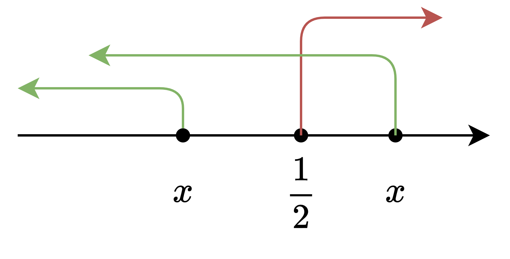

## 条件分布

前面写到条件概率，但那是对事件来讲的，条件分布就是对于随机变量来讲条件概率

设$X$是一个随机变量，其分布函数为
$$
F_{X}(x)=P\{X\le x\},\quad -\infty<x<+\infty,
$$
若另外有一事件$A$已经发生，并且$A$的发生可能会对事件$\{X\le x\}$发生的概率产生影响，则对任一给定的实数$x$，记
$$
F(x\mid A)=P\{X\le x\mid A\},\quad -\infty<x<+\infty,
$$
称$F(x\mid A)$为在$A$发生的条件下，$X$的条件分布函数。

它的计算方式也是跟条件概率差不多。

> 例：设$X$服从$[0,1]$上的均匀分布，求在已知$X>1/2$的条件下的条件分布函数

有
$$
F(x\mid X>1/2)=\frac{P\{X\le x,X>1/2\}}{P\{X>1/2\}}
$$
::: warning

注意这里$P\{X\le x,X>1/2\}$概率的计算方式，是对$x$的范围进行讨论，具体如下

如上图是$X$的两种取值情况，这样我们可以分别讨论
$$
\begin{aligned}
&when\; x\le \frac{1}{2},\qquad P\{X\le x,X>\frac{1}{2}\}=0,\\
\\&when\; x>\frac{1}{2},\qquad P\{X\le x,X>\frac{1}{2}\}=F(x)-F(\frac{1}{2})=F(x)-\frac{1}{2}
\end{aligned}
$$

同时当$x>1$时$F(x)=1$，所以，综上
$$
F(x\mid X>\frac{1}{2})=\begin{cases}
0,\qquad x\le 1/2\\
2x-1,\qquad 1/2<x\le 1\\
1,\qquad x>1
\end{cases}.
$$
:::

## 随机变量的独立性

根据随机变量$Y$
