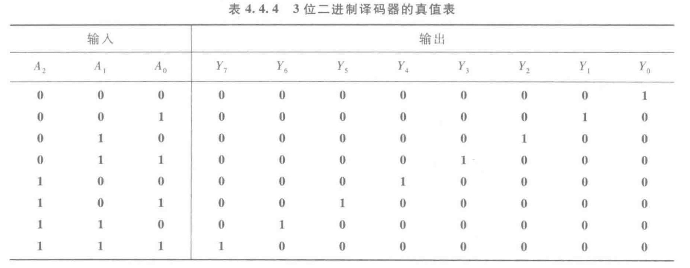
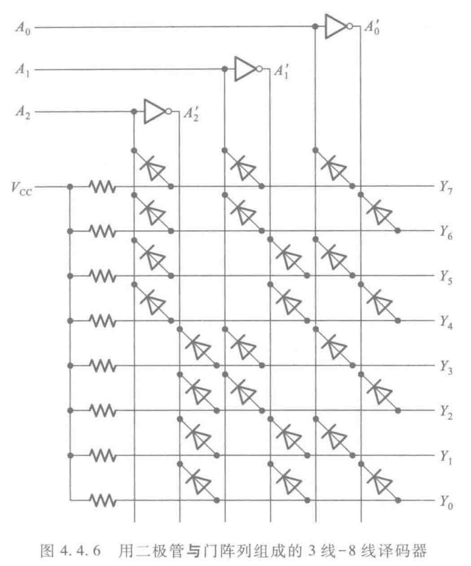
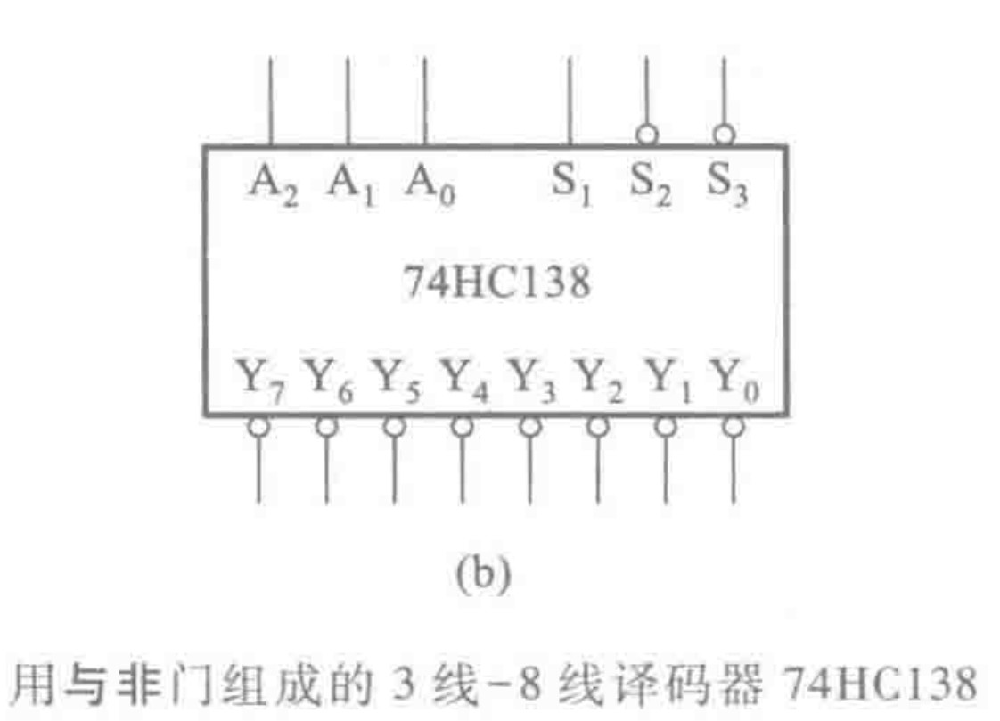
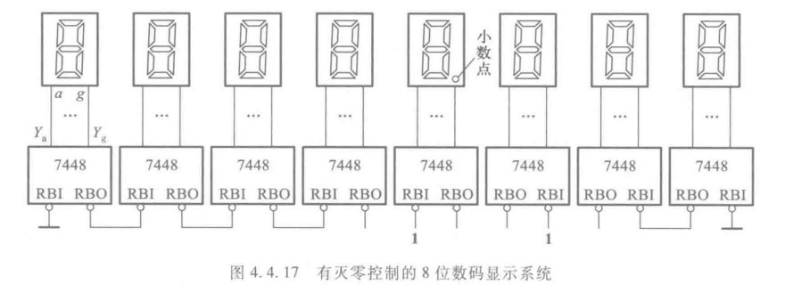

&emsp;&emsp;译码器是编码器的相反操作，即将二进制的编码翻译成单独的一个变量（形象化体现在输出变量的下标等于二进制对应的十进制）。

### 二极管与门阵列组成的3-8译码器

&emsp;&emsp;如图是使用二极管与门阵列组成的$3-8$译码器，其逻辑图很好懂。

&emsp;&emsp;如图是上述译码器的真值表，其与编码器的输出不一样的是高电平有效(注意观察芯片上端口名有无$'$符号)

&emsp;&emsp;其具体实现这里要解释一下，因为在后面有用。

&emsp;&emsp;如图是一个用二极管**与门**阵列组成的$3$线-$8$线译码器，但是实现逻辑还是挺朴素的。

&emsp;&emsp;注意到译码器的逻辑函数可以写为
$$
\begin{aligned}
Y_{0}=A_{2}'A_{1}'A_{0}'\\
Y_{1}=A_{2}'A_{1}'A_{0}\\
\vdots \qquad \quad  \\
Y_{7}=A_{2}A_{1}A_{0}
\end{aligned}
$$
&emsp;&emsp;在结构之前首先需要补充一个知识：

&emsp;&emsp;如上图是该结构核心原理，当$D2$二极管的右边是低电平时，二极管导通，从而形成**管压降**，所以从**检测点**输出的电压只有$0.6574V$，因此此时已可认为是低电平。

::: tip
让我们聚集于$Y_{7}$的连接点$A_{2}$、$A_{1}$、$A_{0}$。无连接任何线的情况下$Y_{7}$是高电平的（是一条导线）；当**任意之一连接点**的二极管导通（即$A_{2}$、$A_{1}$、$A_{0}$任意之一为低电平）则输出为低电平。所以$Y_{7}$输出高电平的条件是$A_{2}$、$A_{1}$、$A_{0}$高电平。其他类似分析即可。其数学表达如下
$$
Y_{7}=A_{2}A_{1}A_{0}
$$
上面对于连线的端口之间是与逻辑关系，这也说明了为什么叫做二极管构成的**与门矩阵**

:::

### 74HC138

> [SN74HC138 数据表, 产品信息与支持](https://www.ti.com.cn/product/cn/SN74HC138?keyMatch=&tisearch=search-everything&usecase=partmatches)

&emsp;&emsp;$74HC138$是用$CMOS$门电路做的。一样不说具体实现，只写使用。

&emsp;&emsp;下图是芯片的逻辑框图以及真值表。

> 这里的真值表是盗的TI芯片的资料，跟书上的不一样，$\bar{G2A}=S_{2}',\;\bar{G2B=}S_{3}',\;G1=S_{1},\;CBA=A_{2}A_{1}A_{0}$，同时$S_{1}$与$S_{2}',S_{3}'$为附加控制端，只有当$S_{1}$为高电平，$S_{2}'+S_{3}'=0$时（即都为低电平），芯片正常工作，其中$S_{2}',\;S_{1}'$可以作为片选信号进行拓展。

::: tip

注意输出是低电平有效

:::

### 74HC42

&emsp;&emsp;这是一个将输入的$BCD$码译成10个高、低电平输出信号。

&emsp;&emsp;依然不讲如何实现，之间如何使用，下图是其真值表

> 我们知道四位二进制可以编码16种状态，而我们的输出只有十个，所以该芯片特殊的地方在于能够拒绝9(从0开始)以后的二进制编码，其响应为全1。

### 显示译码器

&emsp;&emsp;通过上面的译码器，我们可以获得最小项，而通过各种最小项我们就可以用来构成逻辑函数。显示译码器就是这样的译码器，即集成了显示的逻辑函数。

&emsp;&emsp;该芯片的连接众多，其中：

&emsp;&emsp;灭零输入$BI/RBO$为特殊控制端，有时作为输出。当$BI/RBO$作输入使用且$BI=0$时，无论其他输入端是什么电平，所有段输出均为$0$，所以字形熄灭。

&emsp;&emsp;$LT$为灯光测试端口，且低电平触发，当$LT=0$时，$BI/RBO$是输出端，且$RBO=1$，此时无论其他输入什么状态，各段输出均为$1$，显示$8$

&emsp;&emsp;$RBI$为动态灭零输入，当$LT=1$，$RBO=0$，且输入代码为$0000$时，各段输出低电平，故称“灭零”。此时$BI/RBO$是输出端，且$RBO=0$

&emsp;&emsp;动态灭零输出$RBO$，受控于$LT$和$RBI$，当$LT=1$且$RBI=0$，输入代码$0000$，$RBO=0$；若$LT=0$且$RBI=1$则$RBO=1$

&emsp;&emsp;如上图是对于多段输出的控制系统，该图需要从左往右看，和从右往左看。首先从左边开始第一个$RBI=0$，若输入为$0000$则可灭零，且在$RBO$输出信号$0$，若第二个输入依然为$0000$则灭零信号将会传递下去。若第二个输入不为$0000$，则在$RBO$输出$1$，若下一个输入为$0000$，则将不允许灭零，小数点后面的也可同样分析。

