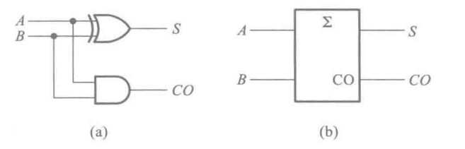
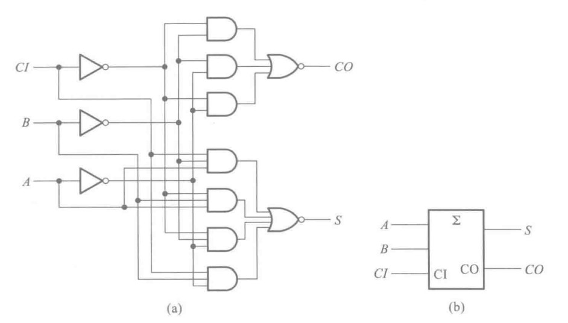
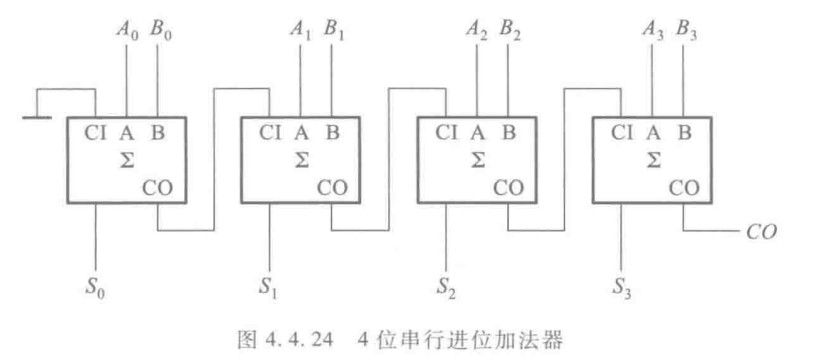
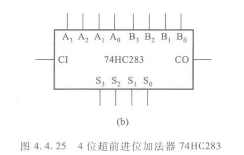

&emsp;&emsp;加法器可能是CPU的计算单元，下面从半加器开始构建一个全加器。

&emsp;&emsp;根据二进制加法原则，我们可以利用异或门来做。

&emsp;&emsp;其中$CO$为进位端口，当是$1+1$时将会产生进位，所以在做全加器时需要考虑来自低位的进位，以及本位的进位输出，所以根据逻辑式我们可以构建全加器

## 74LS183

&emsp;&emsp;嗯？？？怎么突然这么复杂，哎算了，不管了。

&emsp;&emsp;$CI$是来自低位的进位，$CO$是本位进位输出，通过串联全加器就可以构建多位加法器。

&emsp;&emsp;注意到低位是$A_{0}B_{0}$

## 74HC283

&emsp;&emsp;上面的加法器的缺点是数据需要串行输入，即需要一个一个全加器的传递才能出结果，

&emsp;&emsp;所以设计了超前进位加法器$74HC283$，即一开始就可以计算出进位，信号不再需要延迟输入。

