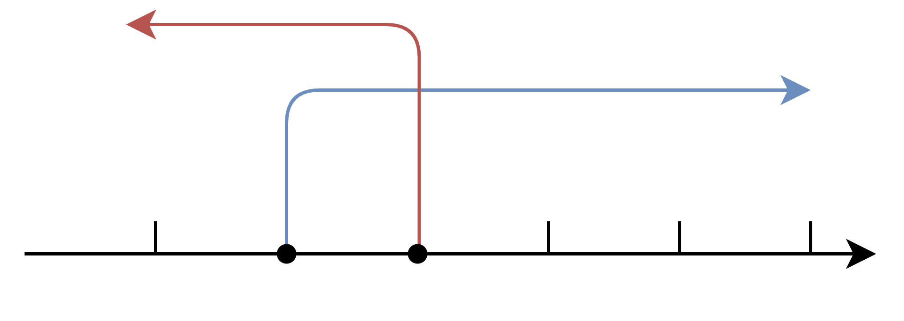
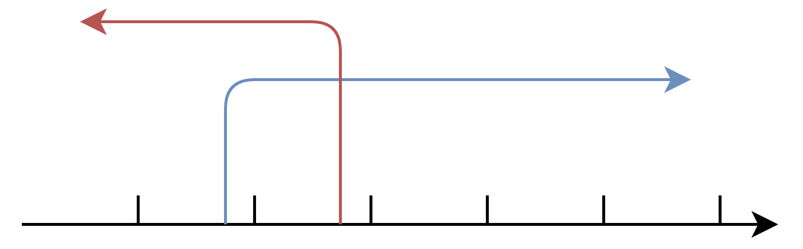

> 设$X$是一个随机变量，如果它全部可能的取值只有有限个或可数无穷个，则称$X$为一个离散型随机变量

&emsp;&emsp;设离散型随机变量$X$的所有可能取值为$x_{i}(i=1,2,\cdots)$，
$$
P\{X=x_{i}\}=p_{i},\quad i=1,2,\cdots
$$
&emsp;&emsp;且称为$X$的**概率分布**或**分布律**，也称为**概率函数**，常常画表表示。

|   $X$   | $x_{1}$ | $x_{2}$ | $\cdots$ | $x_{n}$ | $\cdots$ |
| :-----: | :-----: | :-----: | :------: | :-----: | :------: |
| $p_{i}$ | $p_{1}$ | $p_{2}$ | $\cdots$ | $p_{n}$ | $\cdots$ |

&emsp;&emsp;并且求某一范围的概率，可以得
$$
P\{a\le X\le b\}=P\left\{\bigcup_{a\le x_{i}\le b}\{X=x_{i}\} \right\}=\sum_{a\le x_{i}\le b}p_{i}.
$$
&emsp;&emsp;就是范围内的概率相加。

## 常用离散概率分布

### 两点分布

&emsp;&emsp;若一个随机变量$X$只可能取两种值，且其分布为

$$
P\{X=x_{1}\}=p,\quad P\{X=x_{2}\}=1-p\quad (0<p<1),
$$

则称$X$服从$x_{1},x_{2}$处参数为$p$的**两点分布**

### 二项分布

&emsp;&emsp;在$n$重伯努利试验中，设每次试验中事件$A$发生的概率为$p$。用$X$表示$n$重伯努利试验中事件$A$发生的次数，则$X$的取值为$0,1,\cdots,n$，且对每个$k$，事件$\{X=k\}$即为`n次试验中事件A恰好发生的k次`，有
$$
P\{X=k\}=C_{n}^{k}p^{k}(1-p)^{n-k},\quad k=0,1,\cdots,n.
$$
&emsp;&emsp;即$X$服从参数为$n,p$的**二项分布**。记为$X\sim b(n,p)$（或$B(n,p)$）。

&emsp;&emsp;如上图是$B(10,0.7)$与$B(13,0.5)$的概率图，大致可以看出概率$P\{X=k\}$，先随$k$增大而增大，然后随着$k$的增大而减小。可以证明对于一般的二项分布的图形也具有的性质

> 当$(n+1)p$不为整数时，二项概率$P\{X=k\}$在$k=[(n+1)p]$时达到最大值

> 当$(n+1)p$为整数时，二项概率$P\{X=k\}$在$k=(n+1)p$和$k=(n+1)p-1$时达到最大值

:::tip

$[x]$是为不超过$x$的最大整数

:::

### 二项分布最大值的证明

&emsp;&emsp;证明：

&emsp;&emsp;可以采用比值法
$$
\begin{aligned}
\frac{P(X=(k+1))}{P(X=k)}&=\frac{C_{n}^{k+1} p^{k+1} q^{n-k-1}}{C_{n}^{k} p^{k} q^{n-k}}\\
&=\frac{C_{n}^{k+1}}{C_{n}^{k}} \frac{p}{q}\\
&=\frac{\frac{n !}{(n-k-1) !(k+1) !}}{\frac{n !}{(n-k)!k!}}\frac{p}{1-p}\\
&=\frac{(n-k) ! k !}{(n-k-1) !(k+1) !} \frac{p}{1-p}\\
&=\frac{n-k}{k+1}  \frac{p}{1-p}\le 1
\end{aligned}
$$
&emsp;&emsp;得到
$$
\begin{aligned}
(n-k)p\le(k+1)(1-p)\\
np-kp\le k+1-kp-p\\
k\ge (n+1)p-1
\end{aligned}
$$
&emsp;&emsp;向后比值
$$
\begin{aligned}
\frac{P(X=k)}{P(X=(k-1))}&=\frac{C_{n}^{k} p^{k} q^{n-k}}{C_{n}^{k-1} p^{k-1} q^{n-k+1}}\\
&=\frac{C_{n}^{k}}{C_{n}^{k-1}}\frac{p}{q}\\
&=\frac{\frac{n !}{(n-k) ! k !}}{\frac{n !}{(n-k+1) !(k-1) !}}\frac{p}{1-p} \\
&=\frac{(n-k+1) !(k-1) !}{(n-k) ! k !} \frac{p}{1-p}\\
&=\frac{n-k+1}{k} \frac{p}{1-p}\ge 1
\end{aligned}
$$
&emsp;&emsp;得到
$$
\begin{aligned}
(n-k+1)p\ge k(1-p)\\
np-kp+p\ge k-kp\\
k\le (n+1)p
\end{aligned}
$$
&emsp;&emsp;即得到两个不等式
$$
\left\{\begin{matrix}
k\ge (n+1)p-1 \\
k\le (n+1)p
\end{matrix}\right.
$$
&emsp;&emsp;所以当$(n+1)p$刚好是整数时，$k$的取值有两个，分别是
$$
\begin{aligned}
k_{1}&=(n+1)p-1\\
k_{2}&=(n+1)p
\end{aligned}
$$

&emsp;&emsp;下图是直观的看法

&emsp;&emsp;当$(n+1)p$不为整数时，只有一个最大值	

&emsp;&emsp;所以需要$(n+1)p$向下取整。

### 泊松分布

>若一个随机变量$X$的概率分布为
>$$
>P\{X=k\}=e^{-\lambda}\frac{\lambda^{k}}{k!},\quad \lambda>0,\quad k=0,1,2,\cdots
>$$
>则称$X$服从参数为$\lambda$的泊松分布，记为$X\sim P(\lambda)$或者$X\sim \pi(\lambda)$

::: tip

这里提一下参数$\lambda$的含义与泊松分布的**应用类型**：

泊松分布的应用类型有两类

**第一类**是单位时间按固定频率发生的事件，此时固定的频率就是参数$\lambda$。

**第二类**是$n$很大，$p$很小，$n\times p$等于一个常数，就是$\lambda$。

:::

&emsp;&emsp;泊松分布可以在$n\to\infty,p\to 0,np=\lambda$的情况下视为二项分布的近似。以下是推导过程：
$$
\begin{aligned}
P(k)&=\lim_{n\to \infty}C_{n}^{k}p^{k}(1-p)^{n-k}\\
&=\lim_{n\to \infty}C_{n}^{k}\frac{\lambda}{n}^{k}(1-\frac{\lambda}{n})^{n-k}\\
&=\lim_{n\to \infty}\frac{n(n-1)(n-2)\cdots(n-k+1)}{k!}\frac{\lambda}{n}^{k}(1-\frac{\lambda}{n})^{n-k}\\
&=\lim_{n\to \infty}\frac{\lambda^{k}}{k!}(1-\frac{\lambda}{n})^{n}\cdot\frac{n}{n}\cdot\frac{n-1}{n}\cdots\frac{n-k+1}{n}(1-\frac{\lambda}{n})^{-k}
\end{aligned}
$$
&emsp;&emsp;该式子比较复杂，拆成两个极限来看，其中：
$$
\lim_{n\to \infty}\frac{n}{n}\cdot\frac{n-1}{n}\cdots\frac{n-k+1}{n}(1-\frac{\lambda}{n})^{-k}=1
$$

$$
\begin{aligned}
\lim_{n\to \infty}(1-\frac{\lambda}{n})^{n}&=\lim_{n\to\infty}\{(1+\frac{1}{-\frac{n}{\lambda}})^{-\frac{n}{\lambda}}\}^{-\lambda}\\
&=e^{-\lambda}
\end{aligned}
$$

&emsp;&emsp;所以，代入表达式，可以得到
$$
P(k)=\frac{\lambda^{k}}{k!}e^{-\lambda}
$$
&emsp;&emsp;以上就是泊松分布的概率分布函数

## 相关资料

1. [如何理解泊松分布](https://www.zhihu.com/question/24796044/answer/673838656)

2. [泊松分布的仿真及可视化 ](https://www.luochang.ink/posts/poisson/)

