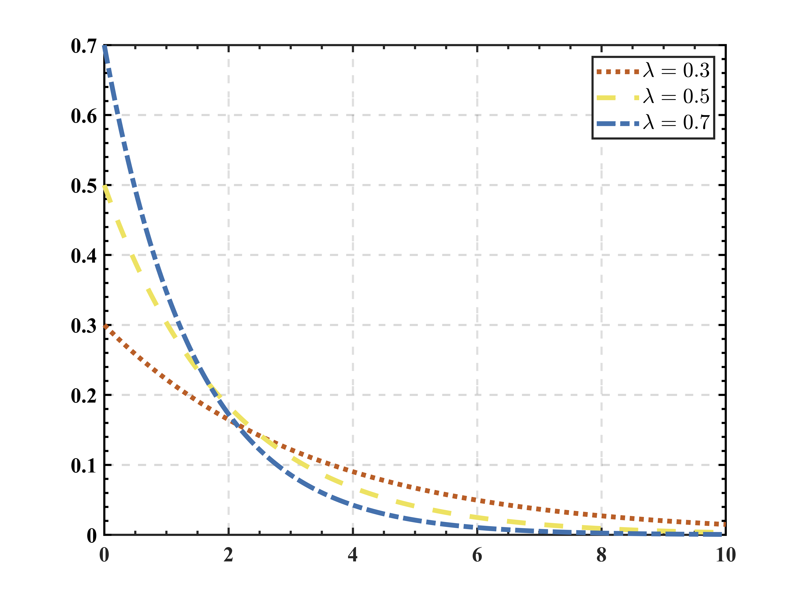
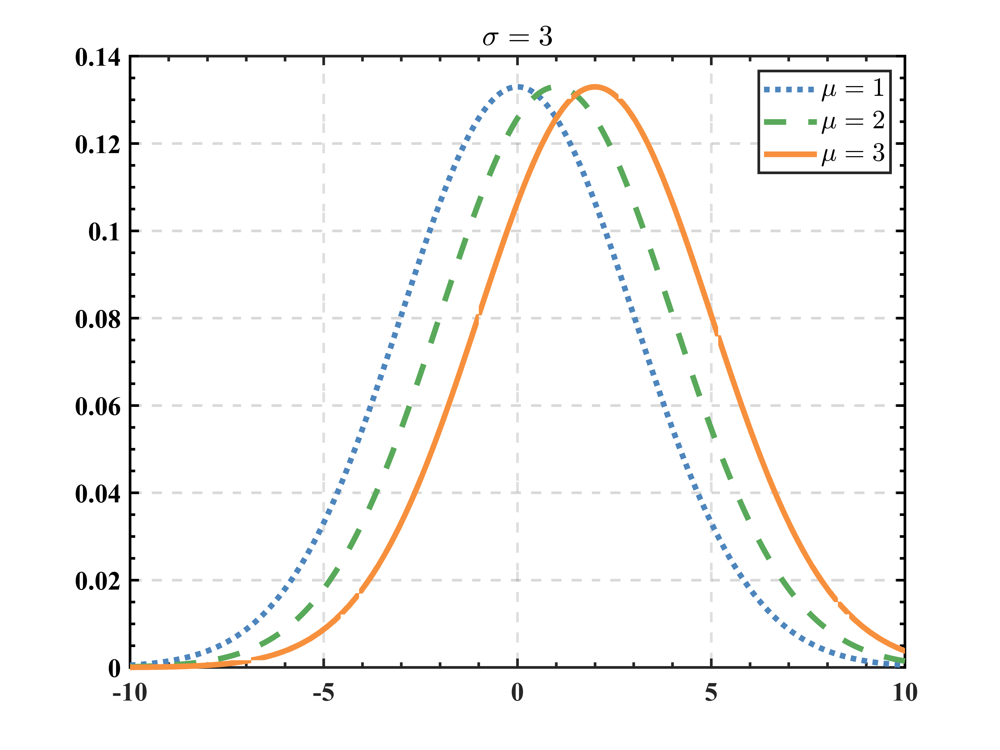
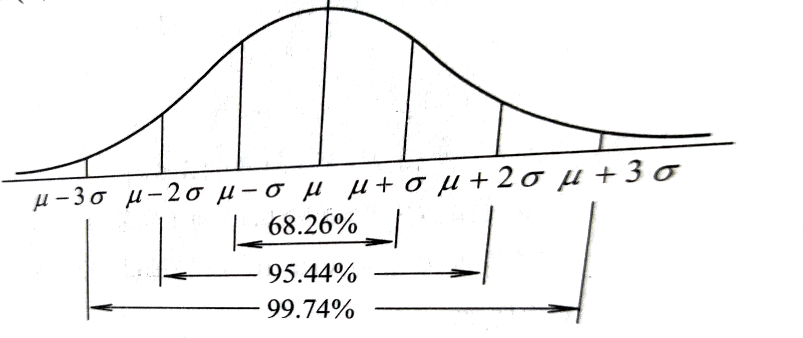

## 随机变量的分布函数

> 定义：设$X$是一个随机变量，称
> $$
> F(x)=P\{X\le x\}\quad (-\infty<x<+\infty)
> $$
> 为$X$的分布函数。有时记作$X\sim F(x)$或$F_{X}(x)$

1. 若视为数轴上随机点的坐标，则分布函数$F(X)$的值就是表示$X$落在区间$(-\infty,x]$内的概率
2. 对任意实数$x_{1},x_{2}$，随机点落在区间$(x_{1},x_{2}]$的概率

$$
P\{x_{1}<X\le x_{2}\}=P\{x\le x_{2}\}-P\{X\le x_{1}\}=F(x_{2})-F(x_{1})
$$

## 离散型随机变量的分布函数

设离散型随机变量的概率分布为

|   $X$   | $x_{1}$ | $x_{2}$ | $\cdots$ | $x_{n}$ | $\cdots$ |
| :-----: | :-----: | :-----: | :------: | :-----: | :------: |
| $p_{i}$ | $p_{1}$ | $p_{2}$ | $\cdots$ | $p_{n}$ | $\cdots$ |

则$X$的分布函数为
$$
F(x)=P\{X\le x\}=\sum_{x_{i}\le x}P\{X=x_{i}\}=\sum_{x_{i}\le x}p_{i}
$$

## 连续型随机变量的分布函数

>因为连续型随机变量不能像离散型分列出来，并求和，只能引入概率密度函数的概念。
>
>定义：如果对随机变量$X$的分布函数$F(x)$，存在非负可积函数$f(x)$，使得对于任意实数$x$，有
>$$
>F(X)=P\{X\le x\}=\int_{-\infty}^{x}f(t)dt,
>$$
>则称$X$为连续型随机变量，$f(x)$为概率密度函数

计算区间型
$$
P\{a<X\le b\}=F(b)-F(a)=\int_{a}^{b}f(x)dx.
$$
同时由上面分布函数的推导可以发现分布函数求导就是概率密度函数
$$
F(x)'=f(x).
$$

## 常用连续型分布

### 均匀分布

> 定义：若连续型随机变量$X$的概率密度为
> $$
> f(x)=\left\{\begin{matrix}
> 1/(b-a),\quad a<x<b \\
> 0,\quad other
> \end{matrix}\right.
> $$
> 则称$X$在区间$(a,b)$上服从均匀分布，记为$X\sim U(a,b)$.
>
> 其分布函数积分可得
> $$
> F(x)=\left\{\begin{matrix}
> 0,\quad x<a \\
> (x-a)/(b-a),\quad a\le x<b\\
> 1,\quad x\ge b
> \end{matrix}\right.
> $$

### 指数分布

>定义：若随机变量$X$的概率密度为
>$$
>f(x)=\left\{\begin{matrix}
>\lambda e^{-\lambda x},\quad x>0 \\
>0,\quad other
>\end{matrix}\right.,\quad\lambda>0
>$$
>则称$X$服从参数为$\lambda$的指数分布，记为$X\sim e(\lambda)$.
>
>其分布函数积分可得
>$$
>F(x)=\left\{\begin{matrix}
>1-e^{-\lambda x},\quad x>0 \\
>0,\quad other
>\end{matrix}\right.,\quad \lambda>0
>$$

&emsp;&emsp;上图是指数分布的大概样子

### 正态分布

> 定义：若随机变量$X$的概率密度为
> $$
> f(x)=\frac{1}{\sqrt{2\pi}\sigma}e^{-\frac{(x-\mu)^{2}}{2\sigma^{2}}}
> $$
> 则称$X$服从参数为$\mu$和$\sigma^{2}$的正态分布，记为$X\sim N(\mu,\sigma^{2})$，其中$\mu$和$\sigma$都是参数且分别为均值，标准差

&emsp;&emsp;上图是不同$\sigma$的概率密度函数

&emsp;&emsp;上图是不同的均值$\mu$

&emsp;&emsp;因为正态分布的概率密度函数不太好求积分，所以还是原始表达式，若$X\sim N(\mu,\sigma^{2})$，**概率分布函数**写为
$$
F(x)=\frac{1}{\sqrt{2\pi}\sigma}\int_{-\infty}^{x} e^{-\frac{(t-\mu)^{2}}{2\sigma^{2}}}dt,\quad -\infty<x<+\infty
$$

&emsp;&emsp;同时任意正态分布可以转化为**标准正态分布**
$$
X\sim N(\mu,\sigma^{2}),Y=\frac{X-\mu}{\sigma}\sim N(0,1)
$$
&emsp;&emsp;也就是说，得到任意的正态分布可以通过以上的转化为标准正态分布，然后查表求概率

### 正态分布的$3\sigma$准则

&emsp;&emsp;如图所示，是在区域$\mu\pm \sigma,\mu\pm 2\sigma,\mu\pm 3\sigma$的区间，在这几个区间概率是比较大的分别是

$$
\begin{aligned}
P\{\mu-\sigma<X \leq \mu+\sigma\} &=P\left\{-1<\frac{X-\mu}{\sigma} \leq 1\right\}=\Phi(1)-\Phi(-1)\\  
&=2 \Phi(1)-1=0.6826 \\
P\{\mu-2 \sigma<X \leq \mu+2 \sigma\}&=\Phi(2)-\Phi(-2)=0.9544\\
P\{\mu-3 \sigma<X \leq \mu+3 \sigma\}&=\Phi(3)-\Phi(-3)=0.9974\\
\end{aligned}
$$
