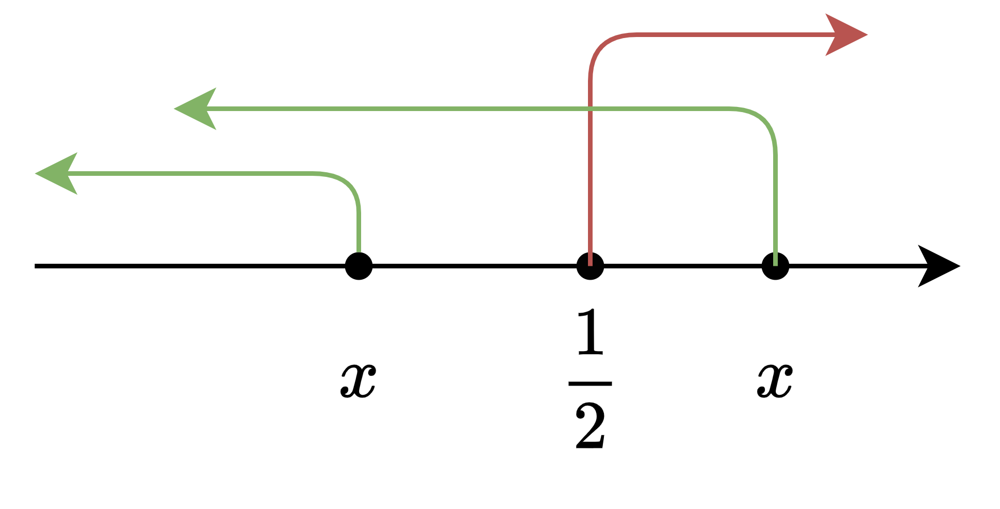

## 条件分布

&emsp;&emsp;前面写到条件概率，但那是对事件来讲的，条件分布就是对于随机变量来讲条件概率

&emsp;&emsp;设$X$是一个随机变量，其分布函数为
$$
F_{X}(x)=P\{X\le x\},\quad -\infty<x<+\infty,
$$
&emsp;&emsp;若另外有一事件$A$已经发生，并且$A$的发生可能会对事件$\{X\le x\}$发生的概率产生影响，则对任一给定的实数$x$，记
$$
F(x\mid A)=P\{X\le x\mid A\},\quad -\infty<x<+\infty,
$$
&emsp;&emsp;称$F(x\mid A)$为在$A$发生的条件下，$X$的条件分布函数。

&emsp;&emsp;它的计算方式也是跟条件概率差不多。

> 例：设$X$服从$[0,1]$上的均匀分布，求在已知$X>1/2$的条件下的条件分布函数

&emsp;&emsp;有
$$
F(x\mid X>1/2)=\frac{P\{X\le x,X>1/2\}}{P\{X>1/2\}}
$$
::: warning

&emsp;&emsp;注意这里$P\{X\le x,X>1/2\}$概率的计算方式，是对$x$的范围进行讨论，具体如下

&emsp;&emsp;如上图是$X$的两种取值情况，这样我们可以分别讨论
$$
\begin{aligned}
&when\; x\le \frac{1}{2},\qquad P\{X\le x,X>\frac{1}{2}\}=0,\\
\\&when\; x>\frac{1}{2},\qquad P\{X\le x,X>\frac{1}{2}\}=F(x)-F(\frac{1}{2})=F(x)-\frac{1}{2}
\end{aligned}
$$

&emsp;&emsp;同时当$x>1$时$F(x)=1$，所以，综上
$$
F(x\mid X>\frac{1}{2})=\begin{cases}
0,\qquad x\le 1/2\\
2x-1,\qquad 1/2<x\le 1\\
1,\qquad x>1
\end{cases}.
$$
:::

## 随机变量的独立性

&emsp;&emsp;上面我们求了一个事件对随机变量分布的影响，对于两个随机变量也是这样的，设$A$是随机变量$Y$所生成的事件：$A=\{Y\le y\}$，且$P\{Y\le y\}>0$，则有
$$
F(x\mid Y\le y)=\frac{P\{X\le x, Y\le y\}}{P\{Y\le y\}}=\frac{F(x,y)}{F_{Y}(y)}.
$$
&emsp;&emsp;一般地，由于随机变量$X,Y$之间是存在相互关联的，因而，一个随机变量的取值可能会影响另一个随机变量的统计规律性，所以我们通过如下方法描述这种关联性。

&emsp;&emsp;设随机变量$(X,Y)$的联合分布函数为$F(X,Y)$，边缘分布函数为$F_{X}(x)$，$F_{Y}(y)$，若对任意的实数$x,y$，有
$$
\begin{aligned}
P\{X\le x,Y\le y\}=P\{X\le x\}P\{Y\le y\},\\
\end{aligned}
$$
&emsp;&emsp;即
$$
F(x,y)=F_{X}(x)F_{Y}(y),
$$
&emsp;&emsp;则称随机变量$X$和$Y$相互独立。

## 离散型随机变量的条件分布与独立性

&emsp;&emsp;设$(X,Y)$是二维离散型随机变量，其概率为
$$
P\{X=x_{i},Y=y_{i}\}=p_{ij},\qquad i,j=1,2,\cdots, 
$$
&emsp;&emsp;由条件概率公式，有
$$
P=\{X=x_{i}\mid Y=y_{i}\}=\frac{P\{X=x_{i},Y=y_{i}\}}{P\{Y=y_{i}\}}=\frac{p_{ij}}{p_{j}},i=1,2,\cdots,
$$
&emsp;&emsp;则称为$Y=y_{i}$条件下随机变量$Y$的**条件概率分布**

&emsp;&emsp;同时若对$(X,Y)$的所有可能的取值$(x_{i},y_{i})$，有
$$
P\{X=x_{i},Y=y_{i}\}=P\{X=x_{i}\}P\{Y=y_{i}\}
$$
&emsp;&emsp;即
$$
p_{ij}=p_{i}p_{j},\quad i,j=1,2,\cdots,
$$
&emsp;&emsp;则称$X$和$Y$相互**独立**的。

::: tip

上面的式子也说明了若要说明两离散随机变量不独立，只需要找一个例子就足够了

:::

## 连续型随机变量的条件密度与独立性

&emsp;&emsp;设$(X,Y)$是二维连续型随机变量，由于对任意$x,y$，
$$
P\{X=x\}=0,\quad P\{Y=y\}=0,
$$
&emsp;&emsp;所以不能直接用条件概率公式引入

&emsp;&emsp;设二维连续型随机变量$(X,Y)$的概率密度为$f(x,y)$，边缘概率密度为$f_{X}(x)$，$f_{Y}(y)$，则对一切使$f_{X}(x)>0$的$x$，定义在$X=x$的条件下的$Y$的**条件密度函数**为
$$
f_{Y\mid X}(y\mid x)=\frac{f(x,y)}{f_{X}(x)}
$$
&emsp;&emsp;类似的，对一切使$f_{Y}(y)>0$，定义在$Y=y$的条件下$X$的**条件密度函数**为
$$
f_{X\mid Y}(x\mid y)=\frac{f(x,y)}{f_{Y}(y)}
$$
&emsp;&emsp;那知道条件概率密度函数就可以求该概率了，对于任意集合$A$
$$
P\{X\in A\mid Y=y\}=\int_{A}f_{X\mid Y}(x\mid y)dx.
$$

> 这个公式可以分解为$f_{X\mid Y}(x\mid y)$对集合$A$做积分，而$Y=y$的条件下$X$的**条件密度函数**可以视为已知$Y=y$的一种一维连续型概率密度函数而已。

&emsp;&emsp;特别地，若取$A=(-\infty,x)$，定义已知$Y=y$的条件下$X$的条件分布函数为
$$
F_{X\mid Y}(x\mid y)=P\{X\le x\mid Y=y\}=\int_{-\infty}^{x}f_{X\mid Y}(t\mid y)dt.
$$
&emsp;&emsp;设$(X,Y)$为二维连续型随机变量，$f(x,y)$为其联合概率密度，$f_{X}(x),f_{Y}(y)$分别为$X$与$Y$的边缘概率密度，若对任意的$x,y$，有
$$
f(x,y)=f_{X}(x)f_{Y}(y)
$$
**几乎处处成立**，则称$X,Y$相互独立。

::: tip

几乎意味着有孤立的点，不连续也是可以的。

:::

